# STM32 心电滤波与心率分析

[](https://github.com/xiaoli5201314-spec/stm32-ecg-heart-rate-monitor/actions/workflows/ci.yml)

**面向 STM32 移植的 C99 信号处理核心，包含可在 PC 复现的采样仿真、滤波、QRS 检测与二进制通信回环。**

这个项目把“采样数据如何可靠送入算法、算法如何输出可核验结果、结果如何变成可恢复的字节流”串成一条可阅读、可测试的工程链路，适合嵌入式软件、信号处理和测试工程方向的技术交流。

**当前交付是固件核心与 PC 测试环境，不是已完成的心电硬件产品。** 仓库没有 PCB/原理图、实际 STM32 外设驱动、可烧录镜像或 VC++/MFC 上位机工程。

| 项目速览 | 当前内容 |
|---|---|
| 技术栈 | C99、GNU Make/GCC、SPSC 环形缓冲、IIR、Savitzky-Golay、CRC-16；可选 NumPy 复核 |
| 目标配置 | STM32F103C8T6；250 Hz 单通道、12-bit ADC 模型；板级移植尚未提供 |
| 核心链路 | ADC counts → 标定换算 → 双级高通 → 双级 50 Hz 陷波 → SG → QRS/RR/BPM → 帧协议 |
| 已执行验证 | **2026-10-02，Ubuntu 22.04 / GCC 11.4.0：28 个套件、4171 条断言、0 失败；pthread 400000 个样本** |
| 数值交叉复核 | 同日 C 系数/CSV 导出与 WSL / NumPy 1.21.5 复核 PASS；全链路逐点最大差异 `5.060e-07 uV` |
| 证据范围 | 上述结果来自主机合成信号与 PC HAL 桩，不是电极输入、板级实时性或临床测试 |

运行命令、来源和待验证项目见 [验证记录](docs/VERIFICATION.md)。GitHub Actions 自动执行主机测试，当前运行状态见首页徽章；NumPy 交叉复核另列为本地验证。

## 先看哪些能力

- **模块边界清楚：** 算法、设备集成、HAL 分层。单样本 DSP 接口不依赖 STM32 寄存器，PC 桩让同一套设备逻辑参与回环测试。
- **滤波参数可推导：** 50 Hz 双二阶陷波在运行时按采样率/频率/Q 设计；SG 不靠固定系数表，而是由阶数和窗长求解最小二乘核。
- **考虑流式启动：** 高通和导数用首样本自举，SG 明确区分预热与稳态；QRS 学习期、RR 初始先验和异常值剔除有显式规则。
- **考虑采集与处理解耦：** 模拟 DMA 半满/全满回调通过泛型 SPSC 环送给主循环，记录高水位、溢出及丢点；Linux 双线程测试覆盖索引发布顺序。
- **协议不仅有打包：** PACK12/DELTA 自动比较长度，CRC-16 校验，滑动窗口接收器覆盖半包、粘包、坏帧和垃圾数据的既定场景。
- **指标有可追溯定义：** 测试输出 SG 参数扫描、心率误差和端到端统计；可选 Python 从 C 导出系数/CSV 复现滤波，而不把演示数据写成硬件实测。

## 主机验证结果

以下为 **2026-10-02 的实际执行记录**，输入是默认 250 Hz、72 BPM 的 30 s 合成 CSV。原始命令、工具链、指标定义与证据边界见 [VERIFICATION.md](docs/VERIFICATION.md)。

| 指标 | 本次结果 | 解释 |
|---|---|---|
| C 与 NumPy 系数最大差异 | `4.645e-13` | 陷波与 SG 系数的交叉复核 |
| 全链路逐点最大差异 | `5.060e-07 uV` | C 导出与 NumPy 流式复现的一致性，不是对真实心电的误差 |
| 50 Hz 分量 RMS | `212.43 → 0.0510 uV`，`-72.4 dB` | 合成记录全链路输出中的单频分量，不是硬件陷波深度 |
| SG 单级峰高保持率 | 平均 **98.39%**，最差 **98.38%** | 干净参考上对齐的 SG 核分析，不是整条链的保持率 |
| 全链路峰高保持率 | 干净参考平均 **89.74%**；含干扰平均 **88.64%**、最差 **81.39%** | 必须同时呈现滤波引入的形态变化，不能只展示 SG 单级数字 |
| 导出心搏通知推算心率 | 真值 `72 BPM`，结果 `72.12 BPM` | 按通知索引的中位 RR 推算；不等于临床准确率 |

峰高按脚本的抛物线峰值拟合及 PQ 段局部基线定义。Python 的 PASS 检查系数、逐点复现和 SG 平均保持率；**并没有要求全链路保持率达到 95%**。NumPy 复核目前是本地验证，不在远程 CI 中执行。

## 文档导航

| 文档 | 适合查看的内容 |
|---|---|
| [DESIGN.md](docs/DESIGN.md) | 分层、时序、滤波推导、QRS、标定、数值与资源取舍 |
| [BUILD_AND_TEST.md](docs/BUILD_AND_TEST.md) | Linux/WSL 构建、测试阈值、数据导出、NumPy 复核与目标板构建边界 |
| [PROTOCOL.md](docs/PROTOCOL.md) | 真实帧字节、大小端、CRC 覆盖、载荷缩放、编码示例与解析限制 |
| [VERIFICATION.md](docs/VERIFICATION.md) | 已执行命令、日期/工具链、测试汇总及待验证项目 |

## 系统架构与完成度

实线是当前源码中的 PC 仿真与固件核心；虚线是尚待补齐的真实板级输入。图中“接收”是 C 协议同步器，不是已有 GUI。

```mermaid
flowchart LR
    subgraph PC["已实现：PC HAL 桩"]
        SYN["合成 P/Q/R/S/T<br/>工频、漂移、噪声"]
        MODEL["增益与中点偏置<br/>理想饱和 ADC"]
        DMA["128 点循环 DMA 模型<br/>每半块 64 点回调"]
        SYN --> MODEL --> DMA
    end

    subgraph CORE["已实现：C99 固件核心"]
        ISR["DMA 回调<br/>拷贝与丢点记账"]
        RING["1024 点 SPSC 采样环"]
        CAL["counts 转电极参考 uV"]
        HP["0.5 Hz 单极高通 × 2"]
        NOTCH["50 Hz / Q=8<br/>双二阶 × 2"]
        SG["SG 4 阶 / 17 点"]
        QRS["QRS 与有效 RR<br/>BPM / SQI"]
        FRAME["整数微伏波形与报告<br/>PACK12 / DELTA / CRC"]
        TX["2048 字节发送环"]
        ISR --> RING --> CAL --> HP --> NOTCH --> SG
        SG --> QRS --> FRAME
        SG --> FRAME --> TX
    end

    subgraph HOST["已实现：主机回环验证"]
        UART["UART 字节内存捕获"]
        SYNC["滑动窗口同步与 CRC"]
        CHECK["载荷解码<br/>样本、序号与心率检查"]
        UART --> SYNC --> CHECK
    end

    BOARD["待实现：安全的模拟前端与 PCB<br/>STM32 定时器 / ADC / DMA / UART 端口"]
    DMA --> ISR
    TX --> UART
    BOARD -.-> ISR
```



### 实现状态矩阵

“已有”指文件中有实现，不等同于任意平台/输入已经验证。

| 模块 | 源码状态 | 验证/交付边界 |
|---|---|---|
| 高通、双级陷波、SG 流式/整段处理 | 已有 | 默认 double 主机测试及本地 NumPy 复核已通过；启动与边缘行为不同 |
| QRS、RR 中位数、BPM、SQI | 已有 | 合成信号测试已通过；无真实心电数据库/临床有效性证据 |
| HRV 统计接口 | 已有，但有已知单位问题 | `sdnn_ms` 实际仍按 RR 采样点计算，不能作为可靠毫秒结果使用 |
| 多点标定拟合与平台均值 | 已有 | 测试输入为模拟平台；默认比例是标称值，`valid=0` |
| SPSC 环、DMA 回调、主循环集成 | 已有 | PC 模型与 Linux pthread 测试已通过；无实际中断时延测量 |
| 波形/HR/STATUS 上报与接收同步器 | 已有 | PC 字节流回环测试已通过；尚无真串口链路/背压可靠性保证 |
| CALIBRATION / ACK | 部分实现 | 构造工具存在，CAL 有解析器；没有设备自动上报/命令确认闭环 |
| NAK / HOST_CMD | 仅枚举 | 未定义载荷与处理器 |
| STM32 定时器、ADC、DMA、UART 端口 | 未提供 | 配置宏与 HAL 接口不等于实际外设驱动 |
| PCB、模拟滤波、RLD、电极保护 | 未提供 | 仅有目标参数；PC 桩不模拟其电路或电气安全 |
| 可烧录固件、启动代码、链接脚本 | 未提供 | `make arm` 仅编译检查，不产生镜像 |
| VC++/MFC 或其他 GUI | 未提供 | 当前有 ASCII 演示、CSV 和协议接收工具 |
| Ubuntu GCC CI | 自动执行；状态见首页徽章 | 推送/PR/手动触发后执行主机测试；不包含硬件验收 |

## 工程细节

### 1. 数据单位与标定边界

[ecg_pipeline.c](firmware/src/ecg_pipeline.c) 的数据流为：

```text
uint16 ADC counts
  -> (counts - intercept_counts) * electrode_uv_per_lsb
  -> 高通 -> 陷波 -> SG
  -> ecg_real_t 电极参考 uV
  -> QRS 检测 / 四舍五入与 int16 饱和 / 波形组帧
```

标称 3.3 V、12-bit、增益 1000 时，比例为 `3300*1000/4096/1000 ≈ 0.805664 uV/count`，这是配置推算值，不是硬件分辨率实测。默认截距为 0，换算值仍含中点偏置对应的直流，随后由高通处理。

标定 API 接收 2..8 个调用方提供的 `(mV, counts)` 点，做线性拟合并输出增益、R² 和残差指标。它没有实现标准信号源、真实平台采集、硬件切换或持久化流程；测试中的平台差值也不能代替 ADC 零点校准。

### 2. 采样、缓冲与任务调度

| 参数 | 当前默认值 | 含义 |
|---|---|---|
| 采样率 | 250 Hz / 4 ms | 仿真与算法的时间基准 |
| 定时器目标参数 | 72 MHz，PSC=287，ARR=999 | 宏中规划值；未配置真实 TIM2 寄存器 |
| DMA 缓冲 | 128 个 `uint16` | 每半块 64 点；相当于 256 ms 数据 |
| ADC 采样环 | 1024 点 | `1024/250 = 4.096 s` 容量，不是无条件可拖延这么久 |
| 单次读取块 | 最多 256 点 | `ecg_device_task()` 会循环读取到环空，并非每次调用最多处理 256 点 |
| 波形组帧 | 24 点 | 单个块代表 96 ms 数据；到达主循环的延迟另受 DMA 分块影响 |
| TX 环 | 2048 字节 | 排队和 UART 丢失有统计，但未实现重传/背压重试 |

DMA 回调通过 `ring_buffer.c` **逐元素 `memcpy`**，不是一次整块拷贝。GCC/Clang 分支用 acquire/release 发布索引；非 GNU 分支的屏障当前为空，不能宣称 Keil/IAR 并发正确性已验证。停止设备不会自动刷新未满的 DMA 半块或波形组帧块。

### 3. 滤波与启动

| 阶段 | 实际实现 | 取舍 |
|---|---|---|
| 基线处理 | 两级 0.5 Hz 单极高通，首样本自举 | 减少初始 DC 阶跃对学习期的影响；可能改变慢变波形与幅值 |
| 工频处理 | 两个 50 Hz、Q=8 的双二阶，转置直接 II 型 | 小状态量、频率可设计；IIR 相位非线性，不能宣称诊断带宽不受影响 |
| 平滑 | SG 4 阶/17 点，归一化横坐标、正规方程、部分主元求解 | 默认参数在特定合成形态上验收，不是所有形态的最优解 |
| SG 启动 | 前 16 点直通，第 17 点开始卷积 | 稳态 SG 延迟为 8 点/32 ms，不代表整条链固定延迟 |

SG 整段接口会在边缘缩窗，点数不足拟合阶数时复制输入；流式接口不是同一种首尾规则。二者内部区间需按半窗延迟对齐后再比较。默认 `double` 和 SG 求解/累加中的 double 工作都要在 Cortex-M3 上重新测量，不能从 PC 测试推算微秒级实时预算。

### 4. QRS 与心率

[heart_rate.c](firmware/src/heart_rate.c) 实际使用：

```text
5 点导数 -> 平方 -> 37 点滑动积分 -> 包络局部极大值
  -> 自适应阈值 -> 不应期/T 波启发式规则
  -> 历史窗口中的绝对峰值细化 -> RR 校验 -> 最近 5 个有效 RR 的中位数
```

- 导数为 `(2x[n]+x[n-1]-x[n-3]-2x[n-4])/8`，不是旧注释中的两点差分。
- 学习期 2 s，前约 250 ms 不参与最大包络统计；积分窗 37 点在 250 Hz 下为 148 ms。
- 不应期 200 ms，T 波判别窗口 360 ms；噪声估计门控上限取 `min(360 ms, RR_median/2)`。
- RR 接纳范围 300..2000 ms，获得至少 3 个有效间期后才使用相对中位数的 40% 偏差规则。
- 超过 `1.66*RR_median` 未检出时降低后续候选阈值，不回查缓存中的漏搏。
- SQI 为信号/噪声包络估计的启发式比例。源码的 `ECTOPIC` 名称在这里仅表示算法的 RR 异常标记，不是心律失常诊断。

### 5. 通信与可恢复性

```text
A5 5A TYPE LEN SEQ_lo SEQ_hi PAYLOAD CRC_lo CRC_hi
```

CRC-16/CCITT-FALSE 覆盖 TYPE、LEN、SEQ 和载荷，不包含同步字；CRC 本身小端发送。波形载荷是滤波后整数微伏，PACK12 精确范围 `[-2048,2047]`，超范围自动使用 DELTA。24 点 PACK12 为 38 字节载荷、46 字节整帧；DELTA 帧长取决于转义数量，不能把某次带宽数字当作固定指标。

设备自动上报波形；心搏报告按处理样本时钟限频，常规报告间隔至少 300 ms；状态报告在主循环检查时达到至少 5 s 处理数据才发送。标定帧和 ACK 没有自动发送流程。具体字段、完整字节示例和接收器约束见 [PROTOCOL.md](docs/PROTOCOL.md)。

## 快速复现与证据

Linux/WSL，在仓库根目录：

```bash
# 完整主机测试，强制重编译
make -C firmware -B test CC=gcc

# 合成信号演示，不是 GUI 或真实板级采集
make -C firmware demo CC=gcc

# 导出 C 系数和 30 s 合成 CSV
make -C firmware -B dump CC=gcc

# 可选：需 NumPy，且必须确认读取本次 C 导出文件
python3 tools/verify_filters.py
```

[2026-10-02 的执行记录](docs/VERIFICATION.md) 包含主机测试、C 导出和 NumPy 复核；上面命令是显式指定 GCC/强制重编译的复现建议，演示模式尚无执行记录。Python 缺少导出文件会回退到自身合成数据；回退模式 `PASS` 不能证明 C 输出正确。依赖安装、文件检查、ARM 检查和全部验收阈值见 [构建与测试](docs/BUILD_AND_TEST.md)。

当前测试可核验的主要验收条件：

| 项目 | 代码中的条件 | 不应扩大为 |
|---|---|---|
| 陷波 | 50 Hz 及五个漂移探针衰减不大于 -20 dB | 实板抑制深度、连续频带保证或最大通带插损 |
| SG | 默认参数平均峰值保持至少 95%，最差单搏至少 93% | 任意真实 QRS 波形的形态保真保证 |
| 心率 | 干净 7 档/含干扰 5 档合成信号稳态误差不超过 2 BPM | 临床准确率、灵敏度或特异度 |
| 端到端 | 模拟 DMA/UART 字节流的数量、序号、载荷、CRC 与心率检查 | 真实 60 s 电极采集、采样零抖动或串口永不丢数据 |

具体测量值必须取自对应日期/工具链的当前日志，不能沿用旧版“实测”表。

## 源码导览

| 路径 | 内容与阅读价值 |
|---|---|
| [firmware/include/](firmware/include/) | 八个公共头文件；从 [ecg_config.h](firmware/include/ecg_config.h) 看默认参数和单位 |
| [firmware/src/](firmware/src/) | 六个 C 实现；算法与设备集成的主要证据 |
| [ecg_pipeline.c](firmware/src/ecg_pipeline.c) | 标定、DSP、DMA 回调、主循环组帧和 UART 发送 |
| [iir_notch.c](firmware/src/iir_notch.c) / [savgol.c](firmware/src/savgol.c) | 高通/陷波的系数与状态，SG 核设计、边缘及流式处理 |
| [heart_rate.c](firmware/src/heart_rate.c) | 阈值、启动、峰值细化、RR 与 HRV 的真实实现 |
| [ring_buffer.c](firmware/src/ring_buffer.c) | 泛型 SPSC、掩码回绕、部分写入和统计 |
| [frame_protocol.c](firmware/src/frame_protocol.c) | CRC、组帧、紧凑载荷与滑动窗口接收 |
| [firmware/hal/](firmware/hal/) | 只有 PC 仿真桩；[hal.h](firmware/include/hal.h) 给出移植接口 |
| [firmware/test/](firmware/test/) | 四个模块测试文件、测试入口和断言工具；含回环、CSV 导出与演示 |
| [firmware/Makefile](firmware/Makefile) | 主机测试、静态库与 ARM 源码检查目标 |
| [firmware/platformio.ini](firmware/platformio.ini) | 平台配置入口，不能代替缺失的板级端口与可烧录工程 |
| [tools/verify_filters.py](tools/verify_filters.py) | NumPy 系数/滤波复核、信号质量分析及可选绘图 |
| [.github/workflows/ci.yml](.github/workflows/ci.yml) | Ubuntu GCC 强制重编译与主机测试 |

### 建议的代码阅读路径

1. 看 [配置](firmware/include/ecg_config.h) 和 [验证记录](docs/VERIFICATION.md)：先明确默认参数、已执行范围与工程未完成部分。
2. 看 [测试入口](firmware/test/run_tests.c) 的 `test_pipeline_integration()`：从模拟数据源跟到 UART 捕获和逐帧校验。
3. 看 [流水线](firmware/src/ecg_pipeline.c) 的 `ecg_pipeline_process()`、`ecg_device_task()`：建立单位、状态与调用关系。
4. 看 [SG](firmware/src/savgol.c)、[陷波](firmware/src/iir_notch.c) 及 [滤波测试](firmware/test/test_filters.c)：核对公式、预热、延迟和指标定义。
5. 看 [QRS](firmware/src/heart_rate.c) 及 [心率测试](firmware/test/test_heart_rate.c)：追踪学习、拒绝、接纳和中位数更新。
6. 看 [协议](firmware/src/frame_protocol.c)、[环形缓冲](firmware/src/ring_buffer.c) 及各自测试：重点检查坏帧、容量不足与并发发布语义。
7. 需要移植时再看 [HAL 接口](firmware/include/hal.h) 与 [设计文档](docs/DESIGN.md)，列出板级缺口，不直接把 PC 桩当驱动。

## 已知限制与后续验收

- **真实硬件缺口：** 没有电路设计文件、RLD/保护/隔离验证、目标板驱动或实测记录。PC 桩只是波形加干扰、增益/偏置、理想量化与回调模型，未建模模拟高低通、共模回路或抗混叠效果。
- **算法适用范围：** 输入以规则合成形态为主，尚未覆盖真实病理波形、电极脱落、运动伪迹的完整范围；SG/高通会改变波形，不能称为诊断信号保真。
- **HRV 单位问题：** 当前 `sdnn_ms` 缺少 `1000/fs` 换算，周期测试不暴露这个问题；接口存在不代表 HRV 已完成正确性验证。
- **测试统计问题：** 通带测试取的是探针衰减中最接近 0 dB 的值，不能推出最大插损上界；SG 默认参数也未被断言为全局最优。
- **数据尾部与背压：** 停止不会补发未完成块；TX 环可能部分写入，UART 前先移除待发字节，短写/零写会记丢失但不重试，可能留下损坏帧。
- **并发与移植：** 设备中断绑定是单实例；环形缓冲只支持 SPSC，非 GNU 屏障为空，CRC 表首次初始化无线程同步；运行中重置需先停生产/消费。
- **接收器容错边界：** 没有坏长度等待超时，载荷校验并非完全严格；批量接收输出数组不足时会消费并丢弃额外帧，详见协议文档。
- **目标资源未测：** 未提供 MCU 链接 map、栈峰值、最坏执行时间或功耗；默认 double、SG 初始化矩阵等需要单独评估，不能宣称 `<4 us/样本` 或 `<0.1% CPU`。

下一步应先完善可核验的板级工程与数据丢失处理，再补真实公开数据集评估和目标 MCU 测量。新增结果应同时保留环境、输入、命令、判据和限制。

## 使用与来源边界

本项目用于学习嵌入式数据流、数字滤波和协议测试，**不是医疗器械，不用于诊断、报警或治疗决策**。本仓库不足以支持安全的人体连接，不应将普通开发板/USB 接线直接用于人体实验。

文档依据当前文件描述实现与验证，不凭“没有版权头”推断全部原创、无外部参考或完整作者贡献，也不补写无法核验的引用/授权。算法名称、标准测试向量与代码所有权是不同问题；贡献归属和外部材料许可应以可核验的历史及来源记录为准。
