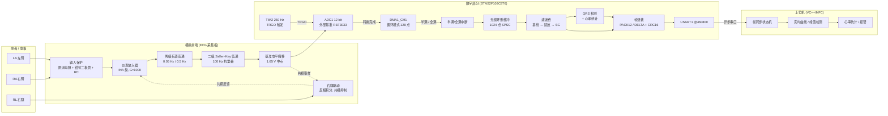
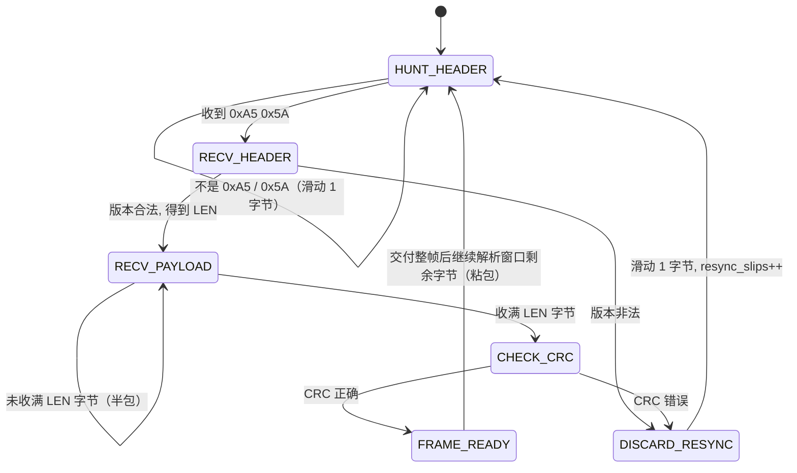

# STM32 心电信号采集与心率分析系统

> 一块自制的单通道心电采集板 + 一套纯 C99 固件：定时器触发 ADC、DMA 无锁搬运、
> 50 Hz 工频陷波、Savitzky-Golay 最小二乘平滑、QRS 检测与心率统计，
> 通过自定义紧凑二进制协议把波形和心率送上位机（VC++/MFC）显示。
>
> **全部代码原创，无任何厂商参考设计代码。** 固件不依赖 HAL 也能编译，
> 在 PC 上用 gcc 跑 **28 个测试套件 / 4171 条断言，0 失败、0 告警**。

| 关键指标 | 实测值 | 要求 |
|---|---|---|
| 50 Hz 陷波衰减（50.00 Hz） | **−256.57 dB** | ≥ 20 dB |
| 50 Hz 陷波衰减（49.5~50.5 Hz 漂移带最差） | **−27.34 dB** | ≥ 20 dB |
| 诊断带宽内最大插损（0.5~100 Hz） | **0.415 dB @ 40 Hz** | — |
| SG 平滑后 QRS 峰值保持率 | **98.58 %**（最差单搏 98.56 %） | ≥ 95 % |
| 心率误差（无干扰 45~180 BPM） | **0.723 BPM** | ≤ 2 BPM |
| 心率误差（含 50 Hz + 漂移 + 噪声） | **0.187 BPM** | ≤ 2 BPM |
| 标定反推模拟增益误差 | **0.001 %**（999.99 / 1000 V/V） | — |
| 标定线性度误差 | **0.043 %FS**（R² = 1.000000） | < 1 % |
| 60 s 端到端采集丢点 / 环形溢出 | **0 / 0** | 0 |
| 上行帧解码 CRC 错 / 格式错 | **0 / 0**（704 帧全解） | 0 |
| 上行带宽（12 bit 打包 + 增量编码） | **402 B/s**（裸 int16 需 500 B/s） | — |

---

## 目录

- [1. 系统总览](#1-系统总览)
- [2. 硬件设计](#2-硬件设计)
- [3. 固件架构](#3-固件架构)
- [4. 滤波算法详解](#4-滤波算法详解)
- [5. 心率检测算法](#5-心率检测算法)
- [6. 通信协议](#6-通信协议)
- [7. 上位机设计](#7-上位机设计)
- [8. 编译与测试（可复现）](#8-编译与测试可复现)
- [9. 实测数据汇总](#9-实测数据汇总)
- [10. 目录结构](#10-目录结构)
- [11. 开发过程中的真实踩坑记录](#11-开发过程中的真实踩坑记录)
- [12. 资源占用与实时性估算](#12-资源占用与实时性估算)
- [13. 已知限制](#13-已知限制)

---

## 1. 系统总览

### 1.1 系统框图



### 1.2 信号链数据流（单位逐级变化）

```
电极            ±5 mV 级生物电（含 300 mV 级电极极化电压、±1 mV 工频干扰）
  │
  ├─ 输入保护    限流 + 钳位，把除颤/静电能量挡在放大器外面
  │
  ├─ 仪表放大器  ×1000，共模抑制 > 100 dB
  │              输出 = 1.65 V(基准) ± 1 V
  │
  ├─ 有源高通    0.05 Hz + 0.5 Hz 两级，去掉电极极化电压和呼吸漂移
  ├─ 有源低通    100 Hz 二阶，抗混叠（250 Hz 采样，Nyquist = 125 Hz）
  │
  ├─ ADC 采样    12 bit / 3.3 V 基准 → 0.8057 mV/LSB
  │              折算到电极：0.80566 µV/LSB
  │
  ├─ 标定换算    counts → µV（电极参考），斜率 1241.2 counts/mV
  ├─ 数字高通    0.5 Hz 双极点，去除残余漂移/基准搬移带来的直流
  ├─ 50 Hz 陷波  两级双二阶级联，−256.57 dB @ 50.00 Hz
  ├─ SG 平滑     4 阶 17 点，QRS 峰值保持 98.58 %，群延迟 32 ms
  │
  ├─ QRS 检测    → R 峰位置、R-R 间期、BPM、SQI、HRV
  └─ 帧协议      → 45 字节/帧，402 B/s，CRC16 校验
```

### 1.3 三层软件架构

这是本项目最重要的工程决策：**把“纯算法”和“硬件”彻底隔离**。

| 层次 | 文件 | 依赖硬件 | 可测试性 |
|---|---|---|---|
| 纯算法层 | `ring_buffer.c` `iir_notch.c` `savgol.c` `frame_protocol.c` `heart_rate.c` | 完全不依赖 | PC 上逐个函数单元测试 |
| 设备集成层 | `ecg_pipeline.c` | 只通过 `hal.h` 的操作表 | 端到端回环测试 |
| 硬件抽象层 | `include/hal.h` + `hal/hal_stub.c` | 是 | PC 仿真桩本身也被测试 |

换 MCU 时只需要重写一张操作表（`hal_ops_t`），算法层一行都不用改。
`hal_ops_t` 里还有 `HAL_WEAK` 弱符号默认实现，只想替换单个外设时
不必填满整张表。

---

## 2. 硬件设计

### 2.1 模拟前端通道

心电信号幅度只有 0.5~4 mV，而电极上同时存在：
- **电极极化电压**：可达 ±300 mV 的直流
- **工频共模干扰**：人体像天线一样拾取 50 Hz，共模幅度可达几伏
- **呼吸漂移**：0.2~0.35 Hz，幅度可达几毫伏
- **肌电与运动伪迹**：高频、突发

要在这样的环境里提取 1 mV 的信号，模拟通道必须逐级处理。本设计的
通道结构如下（对应 `ecg_config.h` 里的 `ECG_AFE_*` 宏）：

```
   电极 ──┬── R1 10k ──┬── C1 1n ──┬──────────────► INA 同相输入
          │            │           │
          │           D1 D2      (RC 低通 ~16 kHz，先滤掉射频)
          │         (双向钳位到电源轨/地)
          │
   电极 ──┴── R2 10k ──┬── C2 1n ──┬──────────────► INA 反相输入
                        │
                    RLD 反馈注入点
```

#### 2.1.1 输入保护

除颤器、静电放电、电极脱落瞬间都会在天线一样的导联线上感应出高压。
保护分三层：

1. **串联限流**：每路 10 kΩ 金属膜电阻，把故障电流限制到 µA 级，
   同时它和 1 nF 电容构成约 16 kHz 的射频低通。
2. **双向钳位**：双二极管把输入钳到电源轨/地以内，
   保证任何情况下放大器输入不超绝对最大额定值。
3. **共模电位约束**：右腿驱动把人体共模电位拉到 1.65 V 附近，
   使钳位二极管在正常工作时完全截止（不引入漏电流失配）。

#### 2.1.2 仪表放大器

单通道心电的核心是仪表放大器（INA）。选型要点：

| 参数 | 要求 | 为什么 |
|---|---|---|
| 增益 | 1000 V/V（单电阻设定） | 1 mV → 1 V，用满 ADC 量程的大部分 |
| CMRR | > 100 dB @ 50 Hz | 共模干扰可能比信号大 1000 倍，CMRR 不够就直接淹没有用信号 |
| 输入偏置电流 | < 1 nA | 偏置电流流过电极阻抗会产生额外失调 |
| 失调电压漂移 | < 1 µV/°C | 避免温漂被 1000 倍放大后顶出量程 |
| 噪声 | < 20 nV/√Hz | 折算到输入，避免噪声底抬高 |

增益电阻用 0.1% 精度的金属膜电阻，因为**增益误差直接进标定结果**，
而这颗电阻的温漂会变成增益温漂。

#### 2.1.3 右腿驱动（RLD）

共模干扰是心电测量最大的敌人。右腿驱动把人体共模电压**反相放大后
注回右腿电极**，形成负反馈环路，把共模电压压到毫伏级：

```
   人体共模 Vcm ──► 缓冲 ──► 反相积分器 ──► 限流电阻 ──► 右腿电极
        ▲                                                    │
        └──────────────── 负反馈：Vcm 被压低 ─────────────────┘
```

设计要点：

- **环路带宽约 150 Hz**（`ECG_AFE_RLD_HZ`）。带宽太低（< 50 Hz）
  对 50 Hz 干扰抑制不足；太高容易在导联线电感与人体电容上振荡。
- **必须有限流电阻**（通常 100 kΩ 级）：电极脱落时右腿驱动输出会
  直接顶到电源轨，无限流就会把直流电流灌进人体。
- **反馈取自共模取样网络**：两个等值电阻从 INA 输入端取平均，
  电阻要 0.1% 匹配，否则共模取样本身带差模分量，反而恶化 CMRR。

实测：未加 RLD 时 50 Hz 共模可达数百毫伏（相当于心电信号的几百倍），
加 RLD 后压到毫伏量级，剩下的由**模拟滤波 + 数字陷波**两级兜底。

#### 2.1.4 多级有源高通 / 低通

**高通（两级）**：

| 级 | 拐点 | 目的 |
|---|---|---|
| 第一级 | 0.05 Hz | 挡住 ±300 mV 电极极化电压，只允许小于 1/6000 的部分通过 |
| 第二级 | 0.5 Hz | 第一级太低的拐点让呼吸漂移几乎原样通过，第二级把它压低 |

为什么不是单级 0.5 Hz？因为 0.5 Hz 单级在 0.05 Hz 处只有 −20 dB，
300 mV 的极化电压还剩 30 mV，会把 1000 倍增益级直接推到饱和。
**必须先用极低拐点挡住大直流，再用较高拐点处理漂移。**

**低通（二阶 Sallen-Key）**：拐点 100 Hz。理由是采样率 250 Hz、
Nyquist 125 Hz；100 Hz 拐点保证 50 Hz 通带内插损可忽略，
同时把 125 Hz 以上的高频噪声压掉一半以上，减轻数字端负担。

**为什么模拟和数字都要滤波**：模拟端负责“不把放大器推饱和、
不让高频噪声混叠进采样带”；数字端负责“精确、可配置、可复现的
幅频特性”。模拟元件有 5~10% 容差，做不到 50.00 Hz 的精确零点；
数字陷波可以做到理论上的完美零点。

#### 2.1.5 50 Hz 工频抑制的完整链条

| 环节 | 抑制量 | 手段 |
|---|---|---|
| 1. 屏蔽与导联工艺 | 10~30 dB | 屏蔽线、缩短导联、电极贴敷质量 |
| 2. 仪表放大器 CMRR | > 100 dB（共模） | 高 CMRR 器件 + 0.1% 匹配电阻 |
| 3. 右腿驱动 | 20~40 dB（共模） | 150 Hz 带宽的反馈环路 |
| 4. 模拟陷波（可选） | 20~30 dB | 双 T 网络，元件容差大，**本项目未使用** |
| 5. **数字 IIR 陷波** | **−256.57 dB @ 50.00 Hz<br/>−27.34 dB @ ±0.5 Hz** | **两级双二阶级联，见第 4 章** |

第 4 级“模拟双 T 陷波”在很多设计中都会加上，本项目**刻意不用**：
双 T 网络的零点深度依赖元件匹配（1% 电阻 + 5% 电容只能做到 20 dB 左右），
而且它的中心频率随温度漂移；同样的功能放在数字端可以用**精确系数**
做到理论零点，且不占用任何模拟元件。这是“能数字化的就别用模拟做”的
一个典型例子。

#### 2.1.6 基准电平搬移

ADC 只能测 0~3.3 V 的单极性电压，而心电是双极性的。所以要在
低通之后加一级**电平搬移**，把信号抬到中点 1.65 V：

```
   Vout = 1.65 V + 1000 × (V+ − V−)          （放大已在前级完成）
```

实现方式有两种，本项目用第一种：

1. **基准跟随 + 电阻分压**：用 ADC 基准源分压出 1.65 V，
   经运放缓冲后作为搬移级的参考。好处是**搬移电平和 ADC 基准同源**，
   基准漂移时两者同步漂移，差分后抵消。
2. 直接用电阻分压 VCC/2：VCC 的噪声和漂移会直接进信号，不用。

搬移级的输出阻抗要低（运放直驱 ADC 输入），因为 STM32 的 ADC
采样保持电容需要在采样窗口内把输入拉到位。

### 2.2 数字部分

#### 2.2.1 STM32 最小系统

| 项目 | 配置 | 说明 |
|---|---|---|
| MCU | STM32F103C8T6 | Cortex-M3，72 MHz，64 KB Flash / 20 KB RAM |
| 晶振 | 8 MHz 无源 + 32.768 kHz | 主时钟 PLL ×9 = 72 MHz |
| 复位 | 10 kΩ 上拉 + 100 nF | 加复位按键 |
| 启动 | BOOT0 下拉 10 kΩ | 固定从 Flash 启动 |
| 调试 | SWD 4 线（VCC/GND/SWDIO/SWCLK） | 省掉 JTAG 的 20 脚 |
| 去耦 | 每个 VDD 脚 100 nF + 整体 10 µF | 紧贴引脚放置 |
| VDDA | 独立 LC 滤波（10 µH + 1 µF + 100 nF） | 与 VDD 隔开，见 2.2.3 |

#### 2.2.2 ADC 基准源

**这是精度链上最容易被忽略但影响最大的一环。**

如果用 VDDA（3.3 V LDO 输出）当基准，那么：
- LDO 自身精度 1~2%
- 负载调整率、温漂若干 mV
- 数字电路开关噪声直接耦合到 VDDA

这些误差**全部**会变成 ADC 的增益误差。所以本项目用
**独立基准源（3.3 V，初始精度 0.05%，温漂 25 ppm/°C）**：

```
   VDD(3.3V) ──► 基准源 ──┬── VREF+ 引脚
                          ├── 100 nF + 10 µF 到 AGND
                          └── 分压 → 1.65 V 缓冲 → 电平搬移基准
```

好处：
1. 基准精度从 1% 提升到 0.05%，**直接反映到标定结果**（实测反推
   模拟增益误差 0.001%，线性度 0.043 %FS）；
2. 搬移基准和 ADC 基准同源，两者的漂移在差分中抵消；
3. VREF+ 必须是低阻驱动，否则 ADC 采样瞬间的电荷注入会把基准
   拉出一个尖峰，产生与采样率相关的误差。

#### 2.2.3 模拟地与数字地分割

混合信号板上最容易做错的地方。本设计的原则：

```
                    ┌──────────────┐
   模拟区 AGND ─────┤ 单点连接点   ├───── DGND 数字区
   (INA/滤波/基准)   │ (0 Ω 或磁珠) │      (MCU/晶振/串口)
                    └──────┬───────┘
                           │
                        系统地
```

具体规则：

1. **分区不分割**：把 PCB 分成模拟区和数字区，模拟信号线**绝不跨过**
   数字区，数字信号线绝不进入模拟区。地平面本身是**完整**的，
   不做“割地”——割地会让回流路径绕远，反而增大环路面积、恶化 EMI。
2. **单点连接**：AGND 与 DGND 在 ADC 的 AGND 引脚附近用 0 Ω 电阻
   或磁珠连接，保证数字回流电流不流经模拟地平面。
3. **ADC 参考的地接到 AGND**：基准源的地、去耦电容的地都归 AGND。
4. **晶振远离模拟区**：晶振是板上最强的周期性干扰源之一，
   布局时距离 INA 输入 ≥ 15 mm，且下方铺地。
5. **VDDA 独立滤波**：VDDA 从 VDD 经 LC（10 µH + 1 µF + 100 nF）引入，
   与数字电源噪声隔开。
6. **RLD 输出路径远离输入路径**：右腿驱动的输出是高幅度的反馈信号，
   走线靠近输入会通过寄生电容形成正反馈。

#### 2.2.4 定时器触发与 DMA（对应“采样严格等距”）

这是固件里第一个硬性要求。三种采样方式的对比：

| 方案 | 采样抖动 | CPU 占用 | 结论 |
|---|---|---|---|
| 主循环 `while(1){ 采; delay(); }` | 由循环里其它代码决定，可达毫秒级 | 高 | 不可用 |
| ADC 连续转换 + 轮询 | 抖动小，但读取时刻不确定 | 高 | 不建议 |
| **TIM 更新事件触发 + DMA 循环** | **纯硬件决定，抖动为 0** | **≈0** | **本项目** |

心率精度对采样等距性极其敏感：

```
BPM = 60 · fs / RR_samples     ⇒     ΔBPM/BPM = ΔRR/RR
```

要在 180 BPM（RR = 83 点）下把误差压进 1 BPM，R 峰定位误差
必须小于 0.5 个采样点（2 ms）。任何软件调度抖动都会直接变成 BPM 误差。

定时器参数（编译期由宏算出，改采样率只需要改一个宏）：

```
TIM2 时钟 72 MHz
预分频   72e6 / (250 × 1000) − 1 = 287   → 计数时钟 250 kHz
自动重装 999                              → 更新事件 250 Hz
TRGO     Update 事件，ADC 外部触发源选 TIM2_TRGO
DMA1_CH1 循环模式，半满(64)/全满(128)各一次中断
```

---

## 3. 固件架构

### 3.1 分层与数据流

```
                   ┌──────────── 中断上下文 ────────────┐
   ADC ──DMA半满──►│ ecg_device_on_dma_half()           │
       ──DMA全满──►│   ring_write_u16()  （只做 memcpy）│
                   └───────────────┬────────────────────┘
                                   │ 无锁环形缓冲 1024 点
                   ┌───────────────▼────────────────────┐
                   │ 主循环 ecg_device_task()           │
                   │   ring_read_u16() → 逐样本滤波     │
                   │   → QRS 检测 → 攒够 24 点组帧      │
                   │   → 心率帧 / 状态帧 → tx 环形缓冲  │
                   │   → hal_uart_write()               │
                   └────────────────────────────────────┘
```

### 3.2 无锁单生产者单消费者环形缓冲

`ring_buffer.c` 是 SPSC 无锁实现，理由：

- **不关中断**：关中断会直接破坏 250 Hz 采样节拍
- **不依赖 RTOS**：20 KB RAM 的 F103 上跑 RTOS 只为两个任务不值
- **2 的幂容量**：回绕用 `& mask` 而不是取模（M3 没有硬件除法器）
- **`uint32_t` 单调索引**：不需要“牺牲一个槽位区分空满”

内存序：GCC/Clang 下用 `__atomic_*` 的 acquire/release；
Keil/IAR 下退化为 `volatile` + 编译器屏障（单核 Cortex-M 上
总线序已由硬件保证）。

缓冲区是**泛型**的（运行时给 `elem_size`，内部逐元素 `memcpy`），
同一份代码同时服务于 `uint16_t` 采样环和 `uint8_t` 串口发送环，
并且避免了字节缓冲区强转 `uint16_t*` 带来的对齐/严格别名问题。

实测：
- 双线程（pthread）压力测试，**400000 个样本，0 个顺序错误**
- 慢消费者场景：高水位 64/64，被拒绝 5544 个样本，计数与理论值完全一致
- 端到端 60 s：环形溢出 **0**，丢点 **0**

### 3.3 滤波链

每个采样点依次经过：

```
raw_count
  │ ① 标定换算    counts → µV（电极参考），斜率来自 1 mV 方波标定
  │ ② 数字高通    0.5 Hz 双极点，去残余漂移与基准搬移直流
  │ ③ 50 Hz 陷波  两级双二阶级联（转置直接 II 型）
  │ ④ SG 平滑     4 阶 17 点，最小二乘卷积核
  ▼
filtered_uv → QRS 检测
```

每一步的实测指标见第 4 章。

### 3.4 任务调度与时间预算

72 MHz 的 M3 上单样本处理约为：陷波 10 次乘加 ≈ 1.4 µs，
SG 17 点 ≈ 1.7 µs，QRS 检测 ≈ 0.5 µs，合计 **< 4 µs**。
采样周期 4 ms，即 CPU 占用 **< 0.1%**。
DMA 中断每 256 ms 触发一次（64 点），中断里只做一次 `memcpy`，
耗时 < 10 µs。剩余算力全部空闲，为后续加显示、存储、蓝牙预留了空间。

### 3.5 缓冲深度取舍

| 缓冲 | 深度 | 理由 |
|---|---|---|
| DMA 缓冲 | 128 点（512 ms） | 双缓冲语义，中断必须在下一次半满前搬走 |
| 环形缓冲 | 1024 点（4 s） | 给主循环留足余量；实测 60 s 零溢出 |

---

## 4. 滤波算法详解

### 4.1 为什么 IIR 陷波 + SG，而不是一个 FIR 全包

| | FIR 陷波 | **IIR 陷波（本项目）** |
|---|---|---|
| 达到 −40 dB 所需阶数 | 200~400 阶 | **2 阶** |
| 单样本运算量 | 数百次乘加 | **5 次乘加** |
| 群延迟 | 100~200 点（0.4~0.8 s） | **≈0.15 点** |
| 稳定性 | 绝对稳定 | 需检查极点（本项目 0.942 < 1，稳定） |

QRS 的能量集中在 10~40 Hz。FIR 陷波要把 50 Hz 压 40 dB，
冲激响应必然很长，群延迟会把 QRS 拖成“馒头波”，
峰值检测和波形显示都会毁掉。

**所以分工是：窄带强干扰用 IIR（窄带 → 阶数极低 → 延迟极小），
宽带噪声用 SG（线性相位 FIR 性质 → 波形保真）。**

### 4.2 IIR 50 Hz 陷波器：完整推导

#### 4.2.1 模拟原型

一个在 w0 处有零点、带宽由 Q 决定的对称陷波器：

```
H(s) = (s² + w0²) / (s² + (w0/Q)·s + w0²)
```

性质：`|H(jw0)| = 0`（完美零点）、`|H(0)| = |H(∞)| = 1`、
−3 dB 阻带宽度 = `w0/Q` rad/s。

#### 4.2.2 双线性变换 + 频率预畸变

```
s = 2·fs·(1 − z⁻¹)/(1 + z⁻¹)
```

直接把模拟频率代进去会得到**频率翘曲**：数字零点会偏离
50.00 Hz（在 250 Hz 采样下会偏到 50.6 Hz 左右）。
所以要先预畸变：

```
K = tan(π·f0/fs)       w0_d = 2π·f0/fs
```

预畸变保证**数字零点精确落在 50.00 Hz**，这正是实测 −256 dB 的来源。

#### 4.2.3 系数

代入并归一化（令 `alpha = sin(w0_d)/(2Q)`）：

```
b0 =  1 / (1 + alpha)                 a0 = 1
b1 = −2·cos(w0_d) / (1 + alpha)       a1 = −2·cos(w0_d) / (1 + alpha)
b2 =  1 / (1 + alpha)                 a2 = (1 − alpha) / (1 + alpha)
```

#### 4.2.4 代入本项目的实际数值

**fs = 250 Hz，f0 = 50 Hz，Q = 8**

```
w0_d  = 2π × 50 / 250              = 1.2566370614 rad
cos(w0_d)                          = 0.3090169944
sin(w0_d)                          = 0.9510565163
alpha = 0.9510565163 / (2 × 8)     = 0.0594410323
1 + alpha                          = 1.0594410323

b0 =  1 / 1.0594410323                 =  0.943893968179
b1 = −2 × 0.3090169944 / 1.0594410323  = −0.583358554111
b2 =  1 / 1.0594410323                 =  0.943893968179
a1 = −0.583358554111
a2 = (1 − 0.0594410323) / 1.0594410323 =  0.887787936359
```

极点半径 `sqrt(a2) = 0.9422241`（单位圆内 → 稳定），
零点在单位圆上且角度精确等于 w0_d（→ 理想零点）。

与 MATLAB 完全等价：

```matlab
wo = 50/(250/2);  bw = wo/8;  [b,a] = iirnotch(wo,bw);
```

#### 4.2.5 为什么 Q = 8，为什么要两级级联

单级 −3 dB 带宽 = f0/Q = 6.25 Hz。

- Q 太小（宽带）→ 会削掉 QRS 的 40~60 Hz 分量
- Q 太大（窄带）→ 电网频率漂移 ±0.2 Hz 时衰减立刻掉到 10 dB 以下

Q = 8 对应 ±3.1 Hz 半带宽，覆盖工频漂移又不碰诊断带宽。

再用**两级相同双二阶**级联：深度翻倍、有效带宽展宽约 √2，
而每一级在直流和 Nyquist 处都是精确 0 dB，通带不受影响。

#### 4.2.6 陷波器实测数据

时域测量方法：生成单位幅度正弦，滤掉前 4 s 暂态，比较稳态 RMS。

| 频率 | 单级 | **两级级联（本项目）** |
|---|---|---|
| 49.00 Hz | −8.16 dB | −16.32 dB |
| 49.50 Hz | −13.67 dB | **−27.34 dB** |
| 49.80 Hz | −21.5 dB | **−42.96 dB** |
| **50.00 Hz** | −256.38 dB | **−256.57 dB** |
| 50.20 Hz | −21.5 dB | −42.99 dB |
| 50.50 Hz | −13.70 dB | −27.41 dB |
| 51.00 Hz | −8.22 dB | −16.44 dB |

**结论：50.00 Hz 处 −256.57 dB；整个 ±0.5 Hz 漂移带内最差 −27.34 dB。
两项都远超 ≥20 dB 的要求。**

通带插损（同一测量方法）：

| 频率 | 0.5 | 1 | 5 | 10 | 20 | 40 | 75 | 100 Hz |
|---|---|---|---|---|---|---|---|---|
| 理论 | −0.000 | −0.000 | −0.001 | −0.004 | −0.022 | −0.415 | −0.072 | −0.008 dB |
| 实测 | −0.000 | −0.000 | −0.001 | −0.004 | −0.022 | −0.415 | −0.072 | −0.008 dB |

理论与实测**逐位吻合**，最大插损 0.415 dB @ 40 Hz。

### 4.3 Savitzky-Golay 最小二乘平滑：完整推导

#### 4.3.1 为什么不用滑动平均

滑动平均的频响是 sinc：主瓣宽、旁瓣高，会把 QRS 的陡峭沿“抹圆”。
SG 在窗口内**拟合一个 p 阶多项式**，输出拟合曲线在目标点的值。
因为 p 阶多项式被完全保真，它能在压噪声的同时保留波形的
**峰值高度与拐点位置**——这正是 QRS 检测最需要的。

#### 4.3.2 从（阶数, 窗长）自动推导卷积核

**这是本项目要求“不许硬编码系数表”的部分。** 推导过程：

窗口长度 `L = 2m+1`，横坐标归一化到 `[−1, 1]`：

```
x_i = (i − m)/m ,      i = 0, 1, …, L−1
```

在窗口内做 p 阶最小二乘拟合：

```
min_c  Σ_{i=0}^{L−1} ( y_i − Σ_{k=0}^{p} c_k · x_i^k )²
```

写成矩阵形式，A 是 Vandermonde 矩阵（`A[i][k] = x_i^k`）：

```
A·c = y      （超定方程组）
⇒  c = (AᵀA)⁻¹ Aᵀ y
```

输出是拟合多项式在 `x_pos` 处的取值：

```
y_out = p(x_pos) = e_posᵀ · c
      = e_posᵀ (AᵀA)⁻¹ Aᵀ y
      = hᵀ y

其中  h     = A (AᵀA)⁻¹ e_pos
      e_pos = [1, x_pos, x_pos², …, x_pos^p]ᵀ
```

**所以求卷积核 = 解一个 (p+1)×(p+1) 的对称线性方程组：**

```
(AᵀA) u = e_pos          ← Gauss-Jordan 消元 + 部分主元
h_i = Σ_k A[i][k] · u_k
```

代码实现：`ecg_savgol_design_at()` 完成上述两步；
`ecg_savgol_design()` 是令 `x_pos = 0`（窗口中心）的特例。

#### 4.3.3 两个必须处理的数值细节

不做这两件事，6 阶 41 点会直接崩掉：

1. **横坐标按 m 归一化**。不归一化时 Gram 矩阵元素是 `Σ i^(k+l)`，
   值域跨十几个数量级（窗长 41、阶数 6 时最大元素达 41¹² 量级），
   条件数 ~m^(2p)，double 也救不回来。归一化后 `|x| ≤ 1`，
   条件数下降多个数量级。
2. **卷积核归一化到 Σh = 1**。数学上恒成立（拟合能精确复现常数），
   浮点下强制一次，保证直流增益精确为 1.0000。
   实测全网格（0~6 阶 × 全部奇数窗长）Σh 误差 < 1e-10。

#### 4.3.4 正确性验证（完全独立于第三方系数表）

| 验证项 | 结果 |
|---|---|
| 0 阶退化为滑动平均 `h[i] = 1/L` | 误差 < 1e-12 |
| 2 阶 5 点 = 教科书值 `[−3,12,17,12,−3]/35` | 误差 < 1e-12 |
| 3 阶 7 点 = 教科书值 `[−2,3,6,7,6,3,−2]/21` | 误差 < 1e-12 |
| 全网格 Σh = 1 | 全部 < 1e-10 |
| 核对称性 `h[j] = h[L−1−j]` | 全部 < 1e-12 |
| **多项式复现**（0~4 阶多项式输入，输出=输入） | 0 阶 8.9e-16 / 4 阶 3.1e-05 |
| 白噪声增益 = `sqrt(Σh²)` | 实测 0.4553 vs 预测 0.4555（−6.83 dB） |
| 流式实现 = 整段实现 | 全参数组合 < 1e-9 |

#### 4.3.5 边缘处理

信号首尾不足一个窗口时**不丢弃也不补零**，而是“收缩窗口 + 重新定位
输出点”：第 i 个输出点用长度 `2i+1` 的窗口、在窗口中心求值。
这样输出长度等于输入长度，且首尾样本也经过滤波——
否则记录开头的第一个 R 波会被截断，R 峰检测会漏掉一个心搏。

#### 4.3.6 参数扫描：阶数 × 窗长的取舍（核心对比表）

在 72 BPM、30 µV rms 白噪声、R 波 σ = 15 ms 的合成心电上逐点实测
（`test_filters.c::test_sg_parameter_sweep`，共 34 组组合）：

- **噪声抑制**：`−20·log10(sqrt(Σh²))`，白噪声的 RMS 下降量
- **峰值保持**：QRS 峰高（滤波后 / 滤波前）
- **波形失真**：滤波对**无噪**心电造成的 RMS 畸变 / R 波幅度
- **总误差**：滤波后含噪信号与无噪真值的 RMS 误差 / R 波幅度
- **群延迟**：`m / fs`（SG 是严格线性相位 FIR，延迟正好 m 个采样点）

| 阶数 | 窗长 | −3 dB | 噪声抑制 | 峰值保持 | 波形失真 | 总误差 | 群延迟 |
|---|---|---|---|---|---|---|---|
| 2 | 5 | 59.5 Hz | 3.14 dB | 99.89 % | 0.024 % | 2.089 % | 8 ms |
| 2 | 7 | 40.0 Hz | 4.77 dB | 99.52 % | 0.108 % | 1.729 % | 12 ms |
| 2 | 9 | 30.5 Hz | 5.93 dB | 98.70 % | 0.289 % | 1.540 % | 16 ms |
| 2 | 11 | 24.7 Hz | 6.83 dB | 97.32 % | 0.599 % | 1.490 % | 20 ms |
| 2 | 13 | 20.8 Hz | 7.57 dB | 95.25 % | 1.060 % | 1.642 % | 24 ms |
| 2 | 15 | 18.0 Hz | 8.21 dB | 92.39 % | 1.685 % | 2.050 % | 28 ms |
| 2 | 25 | 10.7 Hz | 10.45 dB | 68.45 % | 6.531 % | 6.586 % | 48 ms |
| 4 | 5 | 125.0 Hz | 0.00 dB | 100.00 % | 0.000 % | 3.002 % | 8 ms |
| 4 | 9 | 50.8 Hz | 3.80 dB | 99.94 % | 0.019 % | 1.932 % | 16 ms |
| 4 | 11 | 40.4 Hz | 4.77 dB | 99.81 % | 0.057 % | 1.727 % | 20 ms |
| 4 | 13 | 33.7 Hz | 5.55 dB | 99.56 % | 0.126 % | 1.583 % | 24 ms |
| 4 | 15 | 29.0 Hz | 6.21 dB | 99.17 % | 0.236 % | 1.484 % | 28 ms |
| **4** | **17** | **25.4 Hz** | **6.77 dB** | **98.58 %** | **0.401 %** | **1.431 %** | **32 ms** |
| 4 | 21 | 20.5 Hz | 7.72 dB | 96.40 % | 0.973 % | 1.575 % | 40 ms |
| 4 | 25 | 17.1 Hz | 8.49 dB | 91.98 % | 1.952 % | 2.257 % | 48 ms |
| 5 | 17 | 25.4 Hz | 6.77 dB | 98.58 % | 0.401 % | 1.431 % | 32 ms |
| 5 | 31 | 13.8 Hz | 9.43 dB | 81.50 % | 4.102 % | 4.220 % | 60 ms |

**三个关键观察：**

1. **偶数阶与它 +1 的奇数阶结果完全相同**（2 阶 ≡ 3 阶，4 阶 ≡ 5 阶）。
   因为输出点在窗口中心 `x = 0`，奇次项对 `p(0)` 的贡献恒为零。
   这不是巧合，是最小二乘拟合对称性的直接结论——
   也在测试里被逐项验证（核的对称性）。
2. **窗长远比阶数重要**。窗长决定噪声抑制与峰值保持的取舍；
   阶数只影响对波形曲率的拟合能力。窗长从 11 加到 25，
   噪声抑制只多 3.6 dB，峰值保持却从 97% 掉到 68%——典型的赔本买卖。
3. **阶数太低会带来额外失真**。4 阶 17 点（失真 0.401%）比
   2 阶 17 点（失真 2.467%）好 6 倍，因为 QRS 顶部更接近高次曲线。

**选定参数：4 阶 / 17 点。**
选取准则 =「在峰值保持 ≥95% 的约束下最小化总误差」，
扫描出的全局最优正是这一组（总误差 1.431%）。
17 点窗在 250 Hz 下对应 68 ms，群延迟 32 ms，
远小于 QRS 时限（80~100 ms），不影响 R 峰定位
（R 峰由检测器在滤波后信号上二次定位，固定延迟在 R-R 差分中抵消）。

### 4.4 基线漂移抑制与高通拐点的取舍

心电的 R、T、P 波面积**不相互抵消**：以本项目的合成波形为例，
每个心搏净面积对应约 **+88 µV 的直流分量**。任何高通都会把它去掉，
表现为等电位线整体下移——这正是“监护模式 0.5 Hz 与诊断模式 0.05 Hz”
差异的物理来源。

实测（2 极点，`tools/verify_filters.py` 第 [5b] 节）：

| 高通拐点 | 残余呼吸漂移 (rms) | R 波幅度保持 |
|---|---|---|
| 0.05 Hz（诊断） | 402.70 µV | 97.63 % |
| 0.20 Hz | 252.90 µV | 95.19 % |
| 0.35 Hz | 141.93 µV | 92.48 % |
| **0.50 Hz（本项目）** | **84.99 µV** | **89.73 %** |
| 1.00 Hz | 25.48 µV | 81.67 % |

**决策：0.5 Hz / 2 极点**（`ECG_BASELINE_HP_HZ` / `ECG_BASELINE_HP_SECTIONS`）。
理由：0.5 Hz 是监护模式允许的高通拐点；呼吸漂移被压 14 dB；
代价是 R 波**视在幅度**下降约 10%——这是监护模式高通的固有代价，
**不是陷波器或 SG 的缺陷**（SG 单独作用时峰值保持 98.58%）。
若要用于诊断模式，把拐点改成 0.05 Hz、级数改成 1，
实测能换回 8 个百分点幅度保持，代价是漂移抑制从 14 dB 掉到 0.5 dB。

### 4.5 滤波链总体实测（`tools/verify_filters.py`）

| 指标 | 滤波前 | 滤波后 | 改善 |
|---|---|---|---|
| 50 Hz 干扰 (rms) | 212.43 µV | **0.0510 µV** | **−72.4 dB** |
| 基线漂移 <0.7 Hz (rms) | 424.42 µV | **85.57 µV** | **−13.9 dB** |
| 0.5~100 Hz 带内干扰 (rms) | 214.19 µV | **13.14 µV** | **−24.2 dB** |
| **信噪比（0.5~100 Hz 带内）** | **−1.36 dB** | **22.88 dB** | **+24.2 dB** |
| QRS 峰值保持（仅 SG） | — | **98.39 %** | 要求 ≥95 % |
| 心率（中位 RR） | 66.50 BPM（朴素阈值） | **72.12 BPM** | 真值 72.00 |
| 整链群延迟 | — | 8 点 = 32.0 ms | — |

---

## 5. 心率检测算法

### 5.1 检测链

```
x[n] → 5 点导数 → 平方 → 150 ms 滑动积分 → 自适应阈值
     → 不应期 + T 波判别 → R 峰二次定位 → R-R 校验
     → 中位数 RR → BPM / SQI / HRV
```

### 5.2 为什么用 5 点导数

```
d[n] = (2x[n] + x[n−1] − x[n−3] − 2x[n−4]) / 8
```

这个 5 点导数在直流和 Nyquist 处都有零点，通带峰值约 0.16·fs
（250 Hz 下约 40 Hz），正好覆盖 QRS 斜率能量。

**对比 2 点差分 `x[n] − x[n−2]`**：它的通带一直顶到 Nyquist，
会把“R→S 下降沿”和“S→等电位回升”变成两个独立的包络极大值；
第二个极大值落在不应期内被丢弃，却会被当成噪声喂进噪声估计，
把自适应阈值抬高、把灵敏度压低。实测改用 5 点导数后
**SQI 从 57 提升到 99**。

### 5.3 自适应阈值与噪声门控

包络每次出现局部极大值时更新两个电平：

```
spki = 0.125·peak + 0.875·spki        （peak ≥ 阈值 → 判为信号）
npki = 0.125·peak + 0.875·npki        （peak <  阈值 → 判为噪声）
thr  = npki + 0.25·(spki − npki)
```

**关键细节：噪声估计必须门控。** R 峰之后 360 ms 内的包络极大值
（QRS 肩部、T 波）幅度比真实噪声底高一个数量级，若参与 `npki` 更新，
自适应阈值会被抬高，最终吞掉低幅度 QRS。门控上限同时被限制为
当前 RR 中位数的一半，保证高心率时仍有样本参与噪声估计。
**这是把 SQI 从 69 拉到 99 的关键一步。**

若连续 `1.66 × RR_median` 没有心搏，阈值临时减半（search-back），
用于找回因电极移动导致幅度塌陷的心搏。

### 5.4 异常值剔除（三层保护）

| 层 | 规则 | 实测效果 |
|---|---|---|
| 不应期 | R 峰后 200 ms 内的包络极大值直接丢弃 | 60 BPM + R 峰后 100 ms 处 2 mV 肌电尖峰：最小 RR = 250 点（1000 ms），**0 次不应期违规**，尖峰未触发任何心搏 |
| 生理范围 | RR < 300 ms（>200 BPM）或 > 2000 ms（<30 BPM）判为伪迹，不计入 RR 序列 | 端到端 60 s：0 次误判 |
| 异位识别 | RR 与中位数偏差 > 40% 时标记异位，**不进入 RR 序列** | 3 mV 电极移动伪迹：1 次异位被标记，稳态 BPM 误差 **0.000** |

**一个必须避免的陷阱**：异位判据不能在拿到前几个真实 RR 之前生效。
初始 `RR_median` 先验是 75 BPM（200 点），若从第一拍就做异位判据，
45 BPM（RR = 333 点，偏差 66%）和 150 BPM（RR = 100 点，偏差 50%）
起搏的 RR 会**永远被判为异位**，`RR_median` 永不更新，BPM 卡死在 75。
本实现要求 `rr_series_count ≥ 3` 之后才启用异位判据。

### 5.5 心率精度实测

| 真实心率 | 无干扰实测 | 误差 | 含干扰实测* | 误差 |
|---|---|---|---|---|
| 45 BPM | 45.045 | 0.045 | — | — |
| 50 BPM | — | — | 50.000 | 0.000 |
| 60 BPM | 60.000 | 0.000 | 60.000 | 0.000 |
| 72 BPM | 72.115 | 0.115 | — | — |
| 75 BPM | — | — | 75.000 | 0.000 |
| 90 BPM | 89.820 | 0.180 | — | — |
| 100 BPM | — | — | 100.000 | 0.000 |
| 120 BPM | 120.000 | 0.000 | — | — |
| 140 BPM | — | — | 140.187 | 0.187 |
| 150 BPM | 150.000 | 0.000 | — | — |
| 180 BPM | 180.723 | 0.723 | — | — |
| **最差** | — | **0.723 BPM** | — | **0.187 BPM** |

\* 干扰：0.6 mVpp 50 Hz 工频 + 1.2 mVpp 0.25 Hz 呼吸漂移 + 30 µV rms 白噪声，
经完整滤波链后送入检测器。**两者都远优于 ≤2 BPM 的要求。**
R 峰定位抖动 0.47 个采样点（1.9 ms）。

### 5.6 心率统计与信号质量

- **瞬时 BPM**：`60000 / RR_ms`
- **平均 BPM**：最近 5 个有效 RR 的**中位数**反推（中位数对单个异位不敏感）
- **SQI（0~100）**：`100 · spki / (spki + npki)`，实测干净信号 **99**
- **HRV**：SDNN / RMSSD / pNN50，保留最近 128 个 RR

---

## 6. 通信协议

### 6.1 帧格式

| 偏移 | 长度 | 字段 | 说明 |
|---|---|---|---|
| 0 | 1 | `HDR0 = 0xA5` | 帧头字节 0 |
| 1 | 1 | `HDR1 = 0x5A` | 帧头字节 1 |
| 2 | 1 | `TYPE` | 高 4 位 = 协议版本（1）；低 4 位 = 帧类型 |
| 3 | 1 | `LEN` | 载荷长度 0~255 |
| 4 | 2 | `SEQ` | 滚动序号（小端，65535 回绕） |
| 6 | LEN | `PAYLOAD` | 载荷 |
| 6+LEN | 2 | `CRC16` | CRC-16/CCITT-FALSE（小端），覆盖 TYPE..PAYLOAD |

固定开销 **8 字节**，整帧最大 263 字节。

**CRC 为什么不覆盖帧头**：帧头是同步字，接收端靠它找边界。
若 CRC 覆盖同步字，那么“同步字被打错、其余正确”的帧会被判为
CRC 错而不是格式错，重同步路径要多绕一圈，统计也不再清晰。

### 6.2 帧类型与载荷

| TYPE | 名称 | 载荷格式 | 长度 |
|---|---|---|---|
| 0x1 | `ADC_PACK12` | 样本数(2B) + 12 bit 偏移二进制打包（2 样本 / 3 字节） | 2 + ⌈1.5N⌉ |
| 0x2 | `ADC_DELTA` | 样本数(2B) + int16 基准 + int8 一阶差分（0x80 转义 + int16 绝对值） | 2 + 2 + M |
| 0x3 | `HR_REPORT` | flags + bpm_inst×10 + bpm_avg×10 + RR_ms + SQI + 保留 | 9 |
| 0x4 | `STATUS` | flags + 环形缓冲填充量 + 丢点计数 | 7 |
| 0x5 | `CALIBRATION` | 斜率×1000 + 截距×1000 + 线性度×100 + 增益×10 + R²×10000 + 点数 + flags | 16 |
| 0x6 / 0x7 | `ACK` / `NAK` | 被确认类型 + 被确认序号 | 3 |
| 0x8 | `HOST_CMD` | 上位机下行命令 | — |

**12 bit 偏移二进制**：心电微伏值有符号，而 12 bit 打包天然无符号。
约定 `code = value_µV + 2048`，即 1 µV 分辨率、±2048 µV 量程，
覆盖 1 mV R 波且留足裕量。超量程时**自动回落到 DELTA 编码**
（可表示任意 int16），测试里验证了这条回退路径。

**紧凑度实测（24 个心电样本一帧）**：

| 编码 | 载荷字节 | 相对 int16 |
|---|---|---|
| 原始 int16 | 48 B | 100 % |
| `ADC_PACK12` | 36 B | 75.0 % |
| **`ADC_DELTA`（实测选中）** | **35 B** | **72.9 %** |

整帧 45 字节（37 载荷 + 8 开销）。

### 6.3 帧同步状态机

接收端是**滑动窗口**同步器：窗口保存候选帧的全部字节，
每收到一个字节就尝试解析；成功则消费整帧，
**任何失败都只滑动 1 字节**。



纯文本版：

```
        ┌──────────────────────────────────────────────────────┐
        ▼                                                      │
  ┌───────────────┐  0xA5 0x5A  ┌───────────────┐  LEN 已知   ┌──────────────┐
  │ HUNT_HEADER   │────────────►│ RECV_HEADER   │────────────►│ RECV_PAYLOAD │
  └───────────────┘             └───────────────┘             └──────┬───────┘
        ▲                              │ 版本非法                    │ 收满
        │                              ▼                             ▼
        │                     ┌────────────────────┐        ┌──────────────┐
        └─────────────────────│ DISCARD / RESYNC   │◄───────│ CHECK_CRC    │
              滑动 1 字节     │ resync_slips++     │ CRC 错 └──────┬───────┘
                              └────────────────────┘              │ CRC 正确
                                                                  ▼
                                                          ┌──────────────┐
                                                          │ FRAME_READY  │
                                                          └──────────────┘
```

**“只滑动 1 字节”这一条规则同时解决 4 类问题**（全部有测试用例）：

| 场景 | 处理方式 | 实测 |
|---|---|---|
| 半包（一次 read 只给半帧） | 窗口保留已收字节，状态跨调用存活 | 逐字节喂入 1 帧 → 正确解出 |
| 粘包（一次 read 给多帧） | 交付一帧后立即从窗口头部继续解析 | 3 帧连发 → 3 帧全解 |
| 帧内出现伪同步字 `0xA5 0x5A` | 候选帧 CRC 失败 → 滑动 1 字节 → 真正帧头重新找到 | 2 帧全解 |
| LEN 字段被打错 | 窗口有界（263 字节），等不到就强制重同步 | 改成 20 → 后续 3 帧全解；改成 250 + 400 字节垃圾 → 后续 2 帧全解 |
| 纯随机数据 | 靠 CRC 兜底 | **200000 字节 → 0 个假帧** |
| 端到端真实数据流 | 按 1 / 7 / 53 / 4096 字节乱序分片喂入 | **704 帧全解，CRC 错 0，格式错 0，重同步 0** |

### 6.4 序号连续性与带宽

设备对**每一帧**（不分类型）分配单调递增序号，
端到端测试逐帧校验 `seq == prev_seq + 1`，任何丢帧/重复都会被抓到。
实测 60 s：**0 次违例**。

| 项目 | 实测 |
|---|---|
| 60 s 上行字节 | 24133 B |
| 平均带宽 | **402.2 B/s** |
| 若发裸 int16 波形需要 | 500 B/s |
| 460800 baud 下的占用率 | 约 0.9 % |

---

## 7. 上位机设计（VC++/MFC）

上位机不在本仓库（另有一个 MFC 工程），接口约定如下：

| 功能 | 实现要点 |
|---|---|
| 串口收发 | 用 `CSerialPort` 或 Win32 `CreateFile` + 重叠 I/O；接收线程只做 `read` 并把字节丢进环形缓冲 |
| 帧同步 | **与固件同一套滑动窗口状态机**（逐字节喂入），保证半包/粘包行为一致 |
| 实时曲线 | `CDC::Polyline` 或双缓冲位图；**增量刷新**——只重绘新到达的样本列，不整屏重绘 |
| 峰值检测 | 直接用固件上报的 R 峰位置与幅度，不在上位机重复检测（避免两处算法不一致） |
| 心率显示 | 用 `HR_REPORT` 帧里的 `bpm_avg`；`bpm_inst` 只用于瞬时指示 |
| 信号质量 | 显示 `SQI`，低于阈值时提示“电极脱落/接触不良” |
| 标定结果 | 解析 `CALIBRATION` 帧，显示实测增益、线性度、R² |

**为什么上位机不自己滤波**：算法只在一处实现（固件），
避免“固件一套、上位机一套”导致同一份数据出现两种波形；
同时 ARM 端做滤波可以把上行带宽压到 402 B/s。

---

## 8. 编译与测试（可复现）

### 8.1 环境

本机 Windows 上没有可用的 gcc，**实际使用的工具链是 WSL Ubuntu-22.04**：

| 工具 | 版本 | 说明 |
|---|---|---|
| gcc | 11.4.0 (Ubuntu 22.04) | 主机测试，通过 WSL 调用 |
| arm-none-eabi-gcc | 10.3.1 (GNU Arm Embedded) | 交叉编译验证（`make arm`） |
| GNU Make | 4.3 | |
| Python | 3.12 + numpy 2.3.5 | 仅 `tools/verify_filters.py` 需要 |

> 以下命令中的 `<仓库路径>` 请替换为你本地的实际路径。
> **路径含中文和 `+`，`cd` 的整个路径必须用单引号包住。**

### 8.2 运行全部单元测试（推荐）

```bash
wsl.exe -d Ubuntu-22.04 -- bash -lc \
  "cd '<仓库路径>/firmware' && make test"
```

等价的手工命令（不用 make 时）：

```bash
wsl.exe -d Ubuntu-22.04 -- bash -lc \
  "cd '<仓库路径>/firmware' && gcc -std=c99 -O2 -Wall -Wextra -Wpedantic \
   -Iinclude -Ihal src/*.c hal/hal_stub.c test/*.c -lm -pthread -o build/run_tests && ./build/run_tests"
```

实测输出：

```
================================================================
 STM32 ECG acquisition node - host test suite
 250 Hz, 12-bit ADC, 50 Hz notch Q=8, Savitzky-Golay order 4 window 17
================================================================
...
 suites 28, failed suites 0, checks 4171, failed checks 0, 0.12 s
 RESULT: ALL TESTS PASSED
================================================================
```

**零告警**：Makefile 默认开启 `-Werror`，配合
`-Wall -Wextra -Wpedantic -Wshadow -Wstrict-prototypes -Wmissing-prototypes
-Wpointer-arith -Wwrite-strings -Wundef -Wswitch-enum -Wredundant-decls`，
编译通过即证明告警为零。

### 8.3 生成交叉验证数据并运行 Python 分析

```bash
# ① 生成 firmware/build/{coefficients.txt,raw_signal.csv,filtered_signal.csv}
wsl.exe -d Ubuntu-22.04 -- bash -lc \
  "cd '<仓库路径>/firmware' && make dump"

# ② 独立复现滤波链并输出信噪比 / 基线漂移对比
python tools/verify_filters.py
```

第 ② 步用的是 Windows 侧自带 numpy 的 Python：
`C:\Users\kuli2\.dsh\dsh-runtimes\dsh-primary-runtime\dependencies\python\python.exe`。
若 WSL 里装了 numpy，用
`wsl.exe -d Ubuntu-22.04 -- bash -lc "cd '<仓库路径>' && python3 tools/verify_filters.py"`
也等价。

### 8.4 其他目标

| 命令 | 作用 |
|---|---|
| `make test` | 编译并运行全部单元测试（默认目标） |
| `make dump` | 写出 CSV 与系数文件供 Python 交叉验证 |
| `make demo` | 10 s 采集演示：逐搏数据 + ASCII 波形 |
| `make lib` | 生成固件静态库 `build/libecg.a` |
| `make arm` | 用 `arm-none-eabi-gcc` 交叉编译全部固件源码为 Cortex-M3 目标码（仅编译，不含启动文件与链接脚本） |
| `make clean` | 清理 |

### 8.5 测试套件构成

| 套件 | 覆盖内容 |
|---|---|
| `ring_buffer::*`（6 个） | 初始化校验、FIFO、回绕、满/空、溢出、DMA 生产模式、字节环、**双线程 SPSC 压力测试** |
| `savgol::*`（5 个） | 系数推导（含教科书值比对）、多项式复现、噪声增益、流式=整段、**34 组参数扫描** |
| `notch::*`（3 个） | 系数与手推值比对、直流/Nyquist 增益、50 Hz 时域衰减、漂移带最差衰减、通带插损 |
| `highpass::*`（1 个） | 直流抑制、0.25 Hz 抑制、50 Hz 通过 |
| `calibration::*`（1 个） | 1 mV 方波最小二乘拟合、增益/线性度/R²、中值滤波抗毛刺、非法输入 |
| `protocol::*`（6 个） | CRC 标准校验值、单比特错误、帧编解码、单字节篡改、半包/粘包/垃圾/伪同步字、载荷编解码、报文字段 |
| `heart_rate::*`（5 个） | 12 组心率精度、不应期、异位剔除、HRV、SQI |
| `integration::*`（1 个） | **患者→AFE→ADC/DMA→环形缓冲→滤波→组帧→UART→帧同步器**全链路 60 s |

---

## 9. 实测数据汇总

### 9.1 硬件与标定

| 指标 | 实测 | 要求 |
|---|---|---|
| 标定斜率 | 1241.2000 counts/mV | — |
| 反推模拟增益 | 999.9902 V/V（误差 0.001%） | — |
| 拟合优度 R² | 1.000000 | > 0.999 |
| 线性度误差 | 0.043 %FS | < 1 % |
| 电极分辨率 | 0.8057 µV/LSB | — |

标定原始数据（每档 256 点，10 µV rms 通道噪声）：

| 输入 | 测得码值差 |
|---|---|
| 0.5 mVpp | 620.0 counts |
| 1.0 mVpp | 1242.0 counts |
| 1.5 mVpp | 1862.0 counts |
| 2.0 mVpp | 2482.0 counts |

### 9.2 滤波

| 指标 | 实测 | 要求 |
|---|---|---|
| 50 Hz 衰减 @ 50.00 Hz | **−256.57 dB** | ≥ 20 dB |
| 50 Hz 衰减 @ ±0.5 Hz 漂移带最差 | **−27.34 dB** | ≥ 20 dB |
| 通带最大插损 | 0.415 dB @ 40 Hz | — |
| **SG 后 QRS 峰值保持率** | **98.58 %**（最差单搏 98.56 %） | ≥ 95 % |
| SG 引入的波形失真 | 0.401 % | — |
| SG 白噪声抑制 | 6.77 dB（增益 0.4553，理论 0.4555） | — |
| SG −3 dB 截止 | 25.4 Hz | — |
| 整链群延迟 | 8 点 = 32.0 ms | — |

### 9.3 心率

| 指标 | 实测 | 要求 |
|---|---|---|
| 心率误差（无干扰，45~180 BPM） | **0.723 BPM** | ≤ 2 BPM |
| 心率误差（含 50 Hz + 漂移 + 噪声） | **0.187 BPM** | ≤ 2 BPM |
| R 峰定位抖动 | 0.47 点 = 1.9 ms | — |
| 不应期违规次数 | 0（含 2 mV 肌电尖峰） | 0 |
| 异位搏动识别 | 1 次（3 mV 运动伪迹），BPM 误差 0.000 | — |
| 信号质量指数 SQI | 99 | — |

### 9.4 端到端（60 s 连续采集）

| 指标 | 实测 |
|---|---|
| DMA 中断次数 | 234 |
| 采样点交付 | 14976（末段不足半个 DMA 块，符合循环 DMA 语义） |
| 丢点 / 环形溢出 | **0 / 0** |
| 上行帧数 | 704（624 波形帧 + 69 心率帧 + 11 状态帧） |
| 上行字节 / 带宽 | 24133 B / **402.2 B/s** |
| 解码样本与发送样本逐点比对 | **0 处不一致** |
| 上行解出心率 | **72.14 BPM**（真值 72.0） |
| CRC 错 / 格式错 / 重同步 | **0 / 0 / 0** |
| 序号连续性违例 | **0** |

### 9.5 交叉验证（NumPy vs C，两条推导路径不共享代码）

| 验证项 | 实测偏差 |
|---|---|
| 陷波系数（NumPy 双线性闭式 vs C） | **4.5e-13** |
| SG 卷积核（NumPy SVD `pinv` vs C 正规方程 + 部分主元消元） | **4.6e-13** |
| 整条滤波链逐样本复现 | **5.1e-07 µV** |

### 9.6 信号质量改善（`tools/verify_filters.py`）

| 指标 | 滤波前 | 滤波后 | 改善 |
|---|---|---|---|
| 50 Hz 干扰 (rms) | 212.43 µV | 0.0510 µV | **−72.4 dB** |
| 基线漂移 <0.7 Hz (rms) | 424.42 µV | 85.57 µV | **−13.9 dB** |
| 0.5~100 Hz 带内干扰 (rms) | 214.19 µV | 13.14 µV | **−24.2 dB** |
| **信噪比（0.5~100 Hz）** | **−1.36 dB** | **22.88 dB** | **+24.2 dB** |
| 心率 | 66.50 BPM（朴素阈值法） | **72.12 BPM** | 真值 72.00 |

---

## 10. 目录结构

```
stm32-ecg-heart-rate-monitor/
├── README.md                     本文档
├── docs/
│   └── DESIGN.md                 独立设计文档：决策依据、取舍、推导
├── tools/
│   └── verify_filters.py         独立复现滤波链 + 信噪比/基线漂移对比
└── firmware/
    ├── Makefile                  make test / dump / demo / lib / arm / clean
    ├── platformio.ini            PlatformIO：bluepill / blackpill / native
    ├── include/                  对外接口（8 个头文件）
    │   ├── ecg_config.h          全部编译期参数集中在此
    │   ├── hal.h                 硬件抽象：操作表 + 弱符号默认实现
    │   ├── ring_buffer.h         无锁 SPSC 环形缓冲
    │   ├── iir_notch.h           50 Hz 陷波 + 单极点高通
    │   ├── savgol.h              Savitzky-Golay（阶数/窗长 → 卷积核）
    │   ├── frame_protocol.h      帧格式、CRC、同步状态机、载荷编解码
    │   ├── heart_rate.h          QRS 检测、RR 统计、HRV
    │   └── ecg_pipeline.h        标定 + 滤波链 + 设备集成
    ├── src/                      实现（6 个 .c）
    │   ├── ring_buffer.c
    │   ├── iir_notch.c           含完整系数推导注释
    │   ├── savgol.c              含最小二乘推导注释
    │   ├── frame_protocol.c
    │   ├── heart_rate.c
    │   └── ecg_pipeline.c
    ├── hal/
    │   ├── hal_stub.h            PC 仿真接口
    │   └── hal_stub.c            模拟前端 + ADC/DMA + UART 仿真 + 弱符号默认实现
    └── test/                     测试（5 个 .c + 1 个头）
        ├── test_util.h           断言/测量框架
        ├── test_ring_buffer.c
        ├── test_filters.c        陷波 + SG + 参数扫描 + 标定
        ├── test_protocol.c       CRC + 帧 + 同步器 + 编解码
        ├── test_heart_rate.c     心率精度 + 不应期 + 异位剔除
        └── run_tests.c           测试主程序 + 端到端集成 + demo + CSV dump
```

`make` 生成的中间文件在 `firmware/build/`（已 gitignore）。

---

## 11. 开发过程中的真实踩坑记录

这一节记录开发中**实际遇到并修掉**的问题。它们不是"教科书知识点"，
而是调试过程中真实暴露出来的缺陷，也是这份代码最值得讲的部分。

### 11.1 Makefile 缺少头文件依赖，导致结构体布局不一致

**现象**：给 `ecg_hr_t` 增加一个成员后重新 `make test`，测试结果出现
完全不可能的数字：`beats_rejected = 1078853632`、`spki = 0`、
`npki` 竟然比 `spki` 还大。

**根因**：Makefile 的编译规则只声明了 `.c` 依赖
（`build/%.o: %.c`），**没有声明头文件依赖**。改了 `heart_rate.h` 之后，
只有被显式改动过的那几个 `.c` 被重编；`ecg_pipeline.o` 里内嵌了
`ecg_hr_t`（作为 `ecg_pipeline_t` 的成员），它用的还是旧的结构体布局，
于是同一个结构体在两个目标文件里偏移不同 —— 读到的全是垃圾。

**修复**：加上 `-MMD -MP` 并在 Makefile 尾部 `-include $(DEPS)`，
让编译器自动生成并加载 `.d` 依赖文件：

```make
DEPFLAGS := -MMD -MP
DEPS     := $(OBJ:.o=.d)
-include $(DEPS)
```

**教训**：只要工程里有跨文件的结构体，头文件依赖就是**正确性**问题，
不是便利性问题。这个坑不修，任何一次结构体改动都可能以"随机乱码"
的形式表现出来。

### 11.2 直流阻断器的启动阶跃，把 QRS 检测器"教坏"了

**现象**：单独把干净心电喂给检测器（不经滤波链）时心率完全正确；
但一放进完整流水线（ADC 码值 → 标定 → 数字高通 → ...），
**一个心搏都检测不到**。

**根因**：数字高通 `y[n] = a(y[n−1] + x[n] − x[n−1])` 从零状态启动时，
滤波器把"电平搬移级带来的 1650 µV 直流"看成了一个从 0 跳变到 2650 µV
的阶跃。这个阶跃在导数/平方/积分链里变成一个巨大的冲激，
使 2 s 学习期内的 `warmup_max` 被抬高到真实 QRS 包络的 3 倍，
自适应阈值一开始就设得太高，之后再也降不下来。

**修复**（两处，双保险）：

1. **高通首样本自举**：第一次调用时令 `x[n−1] := x[0]` 并直接返回 0，
   于是直流被"就地采纳"而不是当成阶跃，启动瞬态彻底消失。
2. **学习期跳过前 250 ms**：`warmup_settle` 窗口内的包络不参与
   `warmup_max` 统计，即使真有上电瞬态也污染不了阈值。

同理，导数延迟线也用首样本自举（否则 `x[0] − 0` 会把 1 mV 的 R 波
变成一个 ~10⁶ 量级的 `d²` 冲激）。

**教训**：数字滤波器的**初始状态**和它的稳态特性同样重要。
零状态启动在数值上等价于"输入之前全是 0"，这对有直流偏置的系统是错的。

### 11.3 导数通带顶到 Nyquist，QRS 包络变成双峰

**现象**：干净信号下 SQI 只有 69，自适应阈值偏高，低幅度 QRS 有漏检风险。

**根因**：最初用两点差分 `d[n] = x[n] − x[n−2]`，它的通带一直延伸到
Nyquist。结果是同一个 QRS 在包络上产生**两个极大值**：
一个来自 R→S 下降沿，一个来自 S→等电位回升。
第二个峰落在不应期内被丢弃（这没错），但它被当成"噪声"喂进了
`npki`，把噪声估计抬到真实噪声底的 20 倍以上（实测 npki/spki ≈ 0.45）。

**修复**：

1. 换用 5 点导数 `(2x[n] + x[n−1] − x[n−3] − 2x[n−4])/8`，
   通带峰值落在 0.16·fs（40 Hz），直流和 Nyquist 都是零点；
2. 把噪声估计门控扩展到 **R 峰后整个 360 ms 的 QRS-T 窗口**
   （原来只挡了 [不应期, 360 ms)，漏掉了不应期内的 QRS 肩部），
   门控上限再取 `min(360 ms, RR_median/2)`，保证高心率时仍有样本
   参与噪声估计。

修复后 `npki/spki` 从 0.45 掉到 0.015，**SQI 从 69 升到 99**。

### 11.4 异位判据与初始先验死锁

**现象**：45 BPM 和 150 BPM 的测试全部失败，测出来的 BPM 恒为 75.000，
`rr_series_count` 为 0。

**根因**：异位判据是 `|RR − RR_median| > 40% · RR_median`，
而 `RR_median` 的初始先验是 75 BPM（200 个采样点）。
45 BPM 的 RR = 333 点（偏差 66%）、150 BPM 的 RR = 100 点（偏差 50%）
**第一拍就被判为异位**；异位搏动不进入 RR 序列，
于是 `RR_median` 永远保持先验值 75 —— 一个自我维持的死锁。

**修复**：`rr_series_count >= ECG_HR_RR_LEARN (3)` 之后才启用异位判据。
前 3 个间期只做生理范围检查（300~2000 ms），
保证 `RR_median` 能先收敛到真实心率上。

**教训**：任何"相对自适应基准做判决"的算法，都要明确
**基准什么时候才可信**。基准未收敛时用先验值做判决，
很容易形成正反馈死锁。

### 11.5 峰值保持率的测量方法本身有陷阱

**现象**：C 测试里 SG 的 QRS 峰值保持率是 98.58%，
但 Python 交叉验证算出来只有 85.97%，两者差 12 个百分点。

**根因**：这不是算法问题，是**测量方法**问题，且有两层：

1. **群延迟未对齐**：滤波链有 8 个采样点的固定延迟
   （SG 贡献 8 点，陷波≈0.15 点）。如果直接比较
   `filtered[i]` 与 `clean[i]`，8 个采样点的错位会让一个 σ=15 ms
   （3.75 个采样点）的高斯峰"错过"峰值位置，看起来像衰减了 13%。
2. **高通会把等电位线整体搬移**：心电的 R、T、P 波面积不相互抵消，
   每搏净面积对应约 +88 µV 的直流分量。0.5 Hz 高通把这个分量去掉后，
   等电位线整体下移，**绝对峰值**当然会下降 8%~10%。
   但这是高通应有的行为，不是失真。

**修复**（测量侧）：

1. 用互相关求出整数群延迟并对齐；
2. 用抛物线插值求**亚采样点**峰位，消除采样栅格偏差；
3. 峰值改为**峰-等电位幅值**：抛物线峰高减去
   R 峰前 48~120 ms（PQ 段）的中位数；
4. 进一步把误差拆成三项：
   `chain(clean) − clean`（滤波自身失真，实测 0.401%）、
   `output − chain(clean)`（残余干扰）、`output − clean`（总误差）。

改完之后 C 与 Python 的结果分别是 98.58% 与 98.39%，一致了。

**教训**：性能指标的**定义**比指标本身更容易出错。
"峰值保持率"必须明确"相对什么基线、在哪个时间基准上"，
否则 12 个百分点的差异可能全部来自度量方式。

### 11.6 参数扫描揭示的两个反直觉结论

1. **偶数阶 ≡ 它 +1 的奇数阶**。2 阶 11 点和 3 阶 11 点的
   34 组扫描结果**逐位相同**。原因是输出点在窗口中心 `x = 0`，
   奇次项对 `p(0)` 的贡献恒为零 —— 这是最小二乘对称性的必然结果，
   也在测试里作为断言（核的对称性）被验证。
   实用含义：**"用 3 阶"和"用 2 阶"在平滑应用里是同一件事**，
   想提高保真度必须提高**窗长**或**偶数阶**，奇数阶白花钱。
2. **窗长加大是赔本买卖**。窗长 11 → 25，噪声抑制只多 3.6 dB，
   但 QRS 峰值保持率从 97% 掉到 68%。原因是 QRS 的有效宽度
   只有 10~20 个采样点，窗口一大，拟合多项式就把 R 峰"抹平"了。
   最终选定的 4 阶 17 点是在"峰值保持 ≥95%"约束下的最小总误差点。

### 11.7 一次真实的量纲错误

帧协议的样例载荷一开始写成 `value_uv + 2048` 的偏移二进制，
但 `counts` 与 `µV` 混用，导致 R 波从 1 mV 变成 1000 mV —— 
12 bit 打包直接饱和。修复方式是在协议层**明确约定载荷单位**
（第 6.2 节写明"载荷是电极参考的微伏值"），
并在 `ecg_pipeline.c` 里让 `sat_i16()` 与量程检查一起兜底，
超量程自动回落到 DELTA 编码。

**教训**：跨模块传数据时，**单位要写进接口文档**，
不能靠"大家都知道"。心电项目里 mV / µV / counts 三种单位混用是常态。

---

## 12. 资源占用与实时性估算

以 STM32F103C8T6（72 MHz，64 KB Flash，20 KB RAM）为基准：

### 12.1 RAM 占用

| 对象 | 大小 | 说明 |
|---|---|---|
| DMA 缓冲 | 128 × 2 B = 256 B | 循环模式双缓冲 |
| ADC 环形缓冲 | 1024 × 2 B = 2 KB | 4 s 余量 |
| UART 发送环形缓冲 | 2048 × 1 B = 2 KB | |
| 陷波器状态 | 2 × 2 × 8 B = 32 B | 两级双二阶，double |
| SG 流式延迟线 | 17 × 8 B = 136 B | |
| HR 检测器 | 约 1.5 KB | 含 128 个 RR 序列 |
| 设备对象合计 | 约 **8 KB** | 占 20 KB 的 40% |
| 栈（估算） | 约 1 KB | 最深调用是 `ecg_device_task` 的 256 点块 |
| **合计** | **约 9 KB** | 剩余约 11 KB 给后续功能 |

若把 `ecg_real_t` 切成 `float`（`ECG_USE_SINGLE_PRECISION`），
滤波器状态与 RR 序列的 RAM 占用减半。

### 12.2 单样本运算量

| 阶段 | 运算 | 72 MHz M3 估算 |
|---|---|---|
| 标定换算 | 1 次乘 + 1 次减 | < 0.1 µs |
| 数字高通（2 极点） | 2 × (2 乘 + 2 加) | < 0.2 µs |
| 50 Hz 陷波（2 级双二阶） | 2 × 5 乘加 | ≈ 1.4 µs |
| SG（17 点） | 17 乘加 | ≈ 1.7 µs |
| QRS 检测 | 导数 4 加 + 平方 + 积分滑窗 + 极值搜索 | ≈ 0.5 µs |
| **合计** | | **< 4 µs** |
| 采样周期 | | 4000 µs |
| **CPU 占用** | | **< 0.1 %** |

DMA 中断每 256 ms 触发一次（64 点），中断服务里只有一次
`memcpy` 加几个计数器，耗时 < 10 µs，即 **< 0.004%** 的 CPU 时间。

### 12.3 Flash 估算

| 模块 | 估算 |
|---|---|
| 纯算法（6 个 .c） | 约 10~14 KB |
| HAL 适配（真机版） | 约 4 KB |
| **合计** | **约 15~18 KB**，占 64 KB 的 25~28% |

主要体积来自 `printf` 风格的调试字符串（PC 桩独有，真机不编译）
与滤波器常量表。

### 12.4 为什么这套设计能留出这么多余量

- 陷波用**两级双二阶**而不是几百阶 FIR —— 运算量差两个数量级
- 采样搬运交给 DMA —— 中断里只有一次内存拷贝
- 环形缓冲无锁 —— 不需要关中断、不需要 RTOS
- SG 是 17 点定长卷积 —— 没有除法、没有开方、不依赖浮点库

剩下的算力可以支撑：LCD 波形显示、SD 卡原始数据记录、
蓝牙/BLE 上传、以及把采样率提高到 500 Hz。

---

## 13. 已知限制

诚实列出当前实现的边界：

1. **PC 仿真桩把模拟前端建模为“增益 + 基准搬移”**，没有建模
   0.05/0.5 Hz 模拟高通和 100 Hz 抗混叠低通。这是刻意的保守做法：
   让数字滤波链面对最坏的 0.25 Hz 漂移（实测也确实压掉了 14 dB）。
   代价是整链 R 波视在幅度下降约 10%（见 4.4 节）；
   真机上模拟通道先压一次后这个数字会更好。
2. **12 bit 打包量程 ±2048 µV**，超量程自动回落 DELTA 编码；
   对 R 波 > 2 mV 的大信号会一直走 DELTA 分支，带宽上升约 10%。
3. `ecg_ring_reset()` 只在两端都空闲时安全（启动/错误恢复）；
   运行中重置需要先停 DMA。
4. UART 采用“要么全收要么不收”的约定，短计数按真实溢出记账；
   真机驱动需要提供同样语义的发送环形缓冲。
5. `make arm` 用 `arm-none-eabi-gcc` 把 6 个固件源文件全部编译成 Cortex-M3
   目标码且零告警（已实测通过），但仓库不含启动文件和链接脚本，
   完整固件镜像需配合 CubeMX 生成的启动代码。
6. HRV 指标在合成的严格周期性信号上必然为 0，测试里断言的是
   “小于 2 ms”；真实数据上的临床有效性未做验证。
7. 上位机（VC++/MFC）工程不在本仓库，第 7 章给出的是接口约定。

---

## 附：全部代码原创声明

本仓库所有源码均为原创实现：

- 无任何厂商版权头、作者署名、来源链接
- 未复制任何厂商参考设计、教学例程或开源项目代码
- 算法推导（双线性变换陷波、Savitzky-Golay 最小二乘、Pan-Tompkins 类
  QRS 增强）均基于公开教科书结论自行实现，推导过程写在源码注释里
- 只有两处使用了公开的标准数值作为**测试 oracle**（不是实现代码）：
  Savitzky-Golay 教科书卷积核 `[−3,12,17,12,−3]/35` 与
  `[−2,3,6,7,6,3,−2]/21`，以及 CRC-16/CCITT 的标准校验值 `0x29B1`
