# STM32 心电滤波与心率分析

[](https://github.com/xiaoli5201314-spec/stm32-ecg-heart-rate-monitor/actions/workflows/ci.yml)

**面向 STM32 的 C99 心电信号处理项目，贯通采样缓冲、数字滤波、QRS 检测、心率计算与二进制通信。**

本仓库展示项目的公开代码与技术文档。公开内容围绕单通道心电数据流展开，包括 C99 DSP 核心、设备层集成、PC HAL 采样仿真、协议编解码、自动化测试与 NumPy 数值复核工具。

项目体现了嵌入式软件开发中的几项关键能力：划分算法与平台接口、管理采集与处理之间的数据流、设计可解析的通信协议，以及用合成信号和参考计算核验算法输出。以下运行结果统一标注为**主机验证 / 合成信号分析**。

## 项目概览

| 项目速览 | 公开内容 |
|---|---|
| 技术栈 | C99、GNU Make/GCC、SPSC 环形缓冲、IIR、Savitzky-Golay、CRC-16；可选 NumPy 复核 |
| 目标配置 | 按 STM32F103C8T6 组织采样参数与 HAL 接口；默认 250 Hz 单通道、12-bit ADC 采样模型 |
| 核心链路 | ADC counts → 标定换算 → 双级高通 → 双级 50 Hz 陷波 → SG → QRS/RR/BPM → 帧协议 |
| 主机测试记录 | Ubuntu 22.04 / GCC 11.4.0：**28 个套件、4171 条断言、0 失败**；pthread 实际转移 **400000 个样本** |
| 数值交叉复核 | WSL / NumPy 1.21.5：C 系数与 CSV 复核 PASS；全链路逐点最大差异 `5.060e-07 uV` |
| 数据与展示 | PC 合成 P/Q/R/S/T 波形、工频/漂移/噪声叠加、ASCII 演示、CSV 导出与可选绘图 |
| 自动化 | GitHub Actions 在 push、PR 和手动触发时执行 Ubuntu GCC 主机测试 |

希望快速了解项目，可先看下方的工程亮点与测量结果；技术阅读可从 [源码导览](#源码导览) 和 [设计文档](docs/DESIGN.md) 开始。按日期整理的执行命令与工具链见 [验证记录](docs/VERIFICATION.md)。

## 工程亮点

- **分层组织算法与设备逻辑：** `ecg_pipeline_t` 管理单样本 DSP 状态，`ecg_device_t` 串联 DMA 回调、采样环、组帧与 UART；HAL 接口承接平台操作。
- **按参数生成滤波系数：** 双二阶陷波根据采样率、中心频率和 Q 设计；SG 根据阶数与窗长求解最小二乘核，配套系数、频响和参数扫描测试。
- **显式处理流式启动：** 高通和导数采用首样本自举，SG 区分预热与稳态，QRS 检测包含学习期、RR 初始先验和异常间期筛选。
- **采集与处理解耦：** 模拟 DMA 半满/全满回调把数据送入泛型 SPSC 环，记录高水位、溢出与丢点；Linux pthread 压力测试核验样本顺序。
- **覆盖通信收发两端：** PACK12/DELTA 按可用范围与编码长度选择，CRC-16 校验帧内容，滑动窗口接收器处理半包、粘包、CRC 错误及垃圾字节。
- **从单元测试走到整链路复核：** 模块测试与模拟 DMA/UART 回环结合，C 导出的系数和 CSV 再由 NumPy 重算，形成可追踪的数值与数据流验证路径。

## 主机验证结果

以下为 [验证记录](docs/VERIFICATION.md) 中 **2026-10-02 的已执行结果**。C 主机测试覆盖滤波、心率、标定、缓冲与协议；数值分析采用默认 250 Hz、72 BPM 的 **30 s / 7500 点合成 CSV**。

| 指标 | 已记录结果 | 输入与统计方法 |
|---|---|---|
| C 主机测试 | **28 套件 / 4171 断言 / 0 失败** | 默认 C99 配置，Ubuntu 22.04 / GCC 11.4.0 |
| SPSC 并发压力 | **400000 个样本** | Linux pthread 生产者与消费者实际转移 |
| C 与 NumPy 系数最大差异 | `4.645e-13` | C 导出陷波/SG 系数与 NumPy 重算系数 |
| 全链路逐点最大差异 | `5.060e-07 uV` | 从 C 原始 ADC counts 逐样本复现流式输出 |
| 50 Hz 分量 RMS | `212.43 → 0.0510 uV`，`-72.4 dB` | 合成记录全链路输入/输出的 50 Hz 单频投影 |
| SG 单级峰高保持率 | 平均 **98.39%**，最差 **98.38%** | 对干净合成参考执行对齐的 SG 中心核分析 |
| 全链路峰高保持率：干净输入 | 平均 **89.74%** | 对干净参考执行高通、陷波与 SG，观察完整滤波链的形态变化 |
| 全链路峰高保持率：含干扰输入 | 平均 **88.64%**，最差 **81.39%** | 含工频、漂移与噪声的 C 输出相对干净参考 |
| 导出心搏通知推算心率 | 真值 `72 BPM`，结果 `72.12 BPM` | 按 CSV 心搏通知索引的中位 RR 推算，绝对差 `0.12 BPM` |

SG 单级与全链路分别展示平滑阶段和组合滤波的结果，反映不同处理范围下的幅值与干扰抑制取舍。峰高分析跳过前 2 s，按相关性选择整数滞后对齐，再用抛物线峰值拟合减去 R 峰前 48..120 ms 的 PQ 段中位基线。

NumPy 的通过条件由**系数差异 `<1e-9`、全链路逐点差异 `<1e-4 uV`、SG 单级平均峰高保持率 `>=95%`**组成；全链路峰高、50 Hz 分量和通知推算心率作为分析指标同时展示。C 主机测试由 CI 自动执行，NumPy 结果记录于本地 WSL 验证。

## 文档导航

| 文档 | 适合查看的内容 |
|---|---|
| [DESIGN.md](docs/DESIGN.md) | 分层、时序、滤波推导、QRS、标定、数值与资源取舍 |
| [BUILD_AND_TEST.md](docs/BUILD_AND_TEST.md) | Linux/WSL 构建、测试条件、数据导出、NumPy 复核与各 Make 目标 |
| [PROTOCOL.md](docs/PROTOCOL.md) | 帧字节布局、大小端、CRC 覆盖、载荷缩放、编码示例与接收器行为 |
| [VERIFICATION.md](docs/VERIFICATION.md) | 按日期整理的执行命令、工具链、测试汇总与指标定义 |

## 系统架构

下图对应公开代码的**主机合成采样 → C99 DSP 与设备集成 → 字节流回环验证**。采样源、DMA 回调和 UART 捕获由 PC HAL 模型组织，处理与协议模块通过各自的 C 接口衔接。

```mermaid
flowchart LR
    subgraph PC["主机合成采样"]
        SYN["合成 P/Q/R/S/T<br/>工频、漂移、噪声"]
        MODEL["增益与中点偏置<br/>理想饱和 ADC"]
        DMA["128 点循环 DMA 模型<br/>每半块 64 点回调"]
        SYN --> MODEL --> DMA
    end

    subgraph CORE["C99 DSP 与设备集成"]
        ISR["DMA 回调<br/>拷贝与丢点记账"]
        RING["1024 点 SPSC 采样环"]
        CAL["counts 转电极参考 uV"]
        HP["0.5 Hz 单极高通 × 2"]
        NOTCH["50 Hz / Q=8<br/>双二阶 × 2"]
        SG["SG 4 阶 / 17 点"]
        QRS["QRS 与有效 RR<br/>BPM / SQI"]
        FRAME["整数微伏波形与报告<br/>PACK12 / DELTA / CRC"]
        TX["2048 字节发送环"]
        ISR --> RING --> CAL --> HP --> NOTCH --> SG
        SG --> QRS --> FRAME
        SG --> FRAME --> TX
    end

    subgraph HOST["字节流回环验证"]
        UART["UART 字节内存捕获"]
        SYNC["滑动窗口同步与 CRC"]
        CHECK["载荷解码<br/>样本、序号与心率检查"]
        UART --> SYNC --> CHECK
    end

    DMA --> ISR
    TX --> UART
```



### 核心模块

| 模块 | 公开实现 | 工程关注点 |
|---|---|---|
| [DSP 流水线](firmware/src/ecg_pipeline.c) | 标定换算、高通、陷波、SG 和 QRS 按单样本顺序处理 | 统一单位、状态复位与批处理入口 |
| [IIR 滤波](firmware/src/iir_notch.c) | 两级单极高通与可配置级联双二阶陷波 | 系数设计、状态递推与频率响应 |
| [SG 平滑](firmware/src/savgol.c) | 最小二乘核设计、整段处理与流式窗口 | 部分主元求解、边缘缩窗、预热与延迟对齐 |
| [QRS 与心率](firmware/src/heart_rate.c) | 导数、平方、积分、自适应阈值、峰值细化与 RR 中位数 | 学习期、不应期、T 波规则与信号质量估计 |
| [采样环形缓冲](firmware/src/ring_buffer.c) | 泛型 SPSC，支持 `uint16` 样本和字节队列 | 索引发布、容量管理、高水位与溢出统计 |
| [通信协议](firmware/src/frame_protocol.c) | 波形/心率/状态组帧、PACK12/DELTA、CRC 和同步接收 | 长度选择、字节布局与错误后重新同步 |
| [PC HAL](firmware/hal/hal_stub.c) | 合成信号、ADC 量化、DMA 分块回调与 UART 捕获 | 在主机上驱动设备层与通信回环 |
| [NumPy 复核](tools/verify_filters.py) | 读取 C 系数/CSV、重算 SG 核与流式滤波、分析波形 | 逐点差异、频率分量、峰高保持与可选绘图 |

## 工程细节

### 1. 数据单位与标定

[ecg_pipeline.c](firmware/src/ecg_pipeline.c) 的数据流为：

```text
uint16 ADC counts
  -> (counts - intercept_counts) * electrode_uv_per_lsb
  -> 高通 -> 陷波 -> SG
  -> ecg_real_t 电极参考 uV
  -> QRS 检测 / 四舍五入与 int16 饱和 / 波形组帧
```

默认采样模型采用 3.3 V 参考、12-bit ADC 与标称增益 1000，对应配置比例：

```text
3300 × 1000 / 4096 / 1000 ≈ 0.805664 uV/count
```

默认截距为 0，换算值包含模型中点偏置对应的直流，随后交给高通处理。`ecg_cal_fit()` 接收调用方提供的 2..8 个 `(mV, counts)` 点，通过线性拟合输出斜率、截距、增益、R² 与残差指标；`ecg_cal_plateau_mean()` 用三点中值处理后求均值。主机测试用模拟平台数据核验这些计算。

### 2. 采样、缓冲与任务调度

| 参数 | 默认值 | 在公开代码中的作用 |
|---|---|---|
| 采样率 | 250 Hz / 4 ms | 主机采样模型与算法的时间基准 |
| 定时器配置参数 | 72 MHz，PSC=287，ARR=999 | 配置宏给出的 250 Hz 分频关系 |
| DMA 缓冲 | 128 个 `uint16` | 每半块 64 点，对应 256 ms 合成采样数据 |
| ADC 采样环 | 1024 点 | 按采样率折算为 4.096 s 的存储容量 |
| 单次读取块 | 最多 256 点 | 主循环逐块读取，持续处理至采样环为空 |
| 波形组帧 | 24 点 | 每块对应 96 ms 的样本时间跨度 |
| TX 环 | 2048 字节 | 缓冲待发送字节，并配合设备统计记录发送与丢失数量 |

`ecg_device_start()` 按“初始化 HAL → 绑定回调 → 启动 DMA → 启动采样定时器”的顺序组织操作。半满与全满回调统一进入采样环，主循环通过 `ecg_device_task()` 执行 DSP、波形组帧、心搏回调和发送队列排空。

采样环采用逐元素 `memcpy`，GCC/Clang 分支通过 acquire/release 发布索引。DSP 上下文保存处理样本计数，设备运行统计记录采集与丢失样本、DMA 块、环溢出、帧和字节计数；Linux 双线程测试核验生产与消费之间的样本顺序。

### 3. 滤波与启动

| 阶段 | 实现方式 | 处理特性 |
|---|---|---|
| 基线处理 | 两级 0.5 Hz 单极高通，首样本自举 | 处理低频漂移并减轻初始 DC 阶跃对学习期的影响 |
| 工频处理 | 两个 50 Hz、Q=8 的双二阶，转置直接 II 型 | 用级联小状态滤波器处理工频分量；频率与 Q 可配置 |
| 平滑 | SG 4 阶/17 点，归一化横坐标、正规方程、部分主元求解 | 参数扫描结合噪声增益和合成 QRS 峰高保持率分析 |
| SG 启动 | 前 16 点直通，第 17 点开始卷积 | 窗口填满后进入稳态，中心核对应 8 点 / 32 ms 延迟 |

SG 整段接口通过边缘缩窗处理首尾，点数不足拟合阶数时复制输入；流式接口保存最近一窗数据并逐点输出。比较二者内部区间时按半窗延迟对齐。默认 `ecg_real_t` 为 `double`，配置宏提供 `float` 选项；SG 系数求解使用 `double` 工作数据。

### 4. QRS 与心率

[heart_rate.c](firmware/src/heart_rate.c) 的检测路径：

```text
5 点导数 -> 平方 -> 37 点滑动积分 -> 包络局部极大值
  -> 自适应阈值 -> 不应期/T 波启发式规则
  -> 历史窗口中的绝对峰值细化 -> RR 校验 -> 最近 5 个有效 RR 的中位数
```

| 规则 | 默认参数与处理 |
|---|---|
| 导数 | `(2x[n]+x[n-1]-x[n-3]-2x[n-4])/8`，首样本初始化历史 |
| 学习与积分 | 学习期 2 s；包络最大值统计从约 250 ms 后开始；37 点积分窗对应 148 ms |
| 峰值筛选 | 不应期 200 ms，T 波判别窗口 360 ms |
| 噪声门控 | 上限取 `min(360 ms, RR_median/2)` |
| RR 接纳 | 300..2000 ms；至少 3 个有效间期后启用相对中位数的 40% 偏差规则 |
| 心率平滑 | 最近 5 个有效 RR 的中位数换算 BPM |
| 长间期处理 | 超过 `1.66*RR_median` 时降低后续候选阈值 |
| SQI | 信号/噪声包络估计形成 0..100 的启发式质量分值 |

心搏输出包含检测类别、样本索引、RR 接纳标志和即时/平滑 BPM。设备层将 RR 换算为毫秒，并将 BPM 按 `×10` 的整数形式写入报告；`ECTOPIC` 字段承载算法的 RR 异常间期标记。

### 5. 通信与字节流解析

```text
A5 5A TYPE LEN SEQ_lo SEQ_hi PAYLOAD CRC_lo CRC_hi
```

CRC-16/CCITT-FALSE 覆盖 TYPE、LEN、SEQ 和载荷，同步字单独用于定位；序号与 CRC 采用小端。波形载荷使用滤波后的整数微伏，先四舍五入并饱和到 `int16`，再选择紧凑编码。

- **PACK12：** 精确表示 `[-2048,2047] uV`；24 点对应 38 字节载荷、46 字节整帧。
- **DELTA：** 通过差值和转义表示 `int16` 样本，编码长度随样本变化；超出 PACK12 范围时选择此格式。
- **编码选择：** 在表示范围允许时比较两种载荷长度，选用更紧凑的形式。
- **报告节奏：** 波形按 24 点组帧；常规心搏报告间隔至少 300 ms；主循环按处理样本时钟检查 5 s 状态报告周期。
- **接收同步：** 滑动窗口结合同步字、长度和 CRC，测试覆盖分块输入、连续帧、错误帧与垃圾字节后的重新同步。

具体字段、完整字节示例和解析规则见 [PROTOCOL.md](docs/PROTOCOL.md)。

## 快速复现

### 1. 构建并运行主机测试

环境为 Linux 或 WSL、GNU Make、GCC 和标准数学库。在仓库根目录执行：

```bash
make -C firmware -B test CC=gcc
```

默认构建启用 C99、告警检查与 `-Werror`；Linux 自动启用 pthread SPSC 测试。测试结束可查看套件/断言汇总及 `RESULT: ALL TESTS PASSED`。已执行结果为上文列出的 28 个套件、4171 条断言，原始命令与环境见 [VERIFICATION.md](docs/VERIFICATION.md)。

### 2. 导出合成信号并用 NumPy 复核

使用已有 NumPy 环境，或创建独立环境：

```bash
python3 -m venv .venv
source .venv/bin/activate
python3 -m pip install numpy
```

生成本次 C 输出，检查三份文件后运行复核：

```bash
make -C firmware -B dump CC=gcc
ls -l firmware/build/coefficients.txt firmware/build/raw_signal.csv firmware/build/filtered_signal.csv
python3 tools/verify_filters.py
```

`dump` 运行测试并导出 30 s 合成记录。复核时确认脚本日志加载了同一次 C 导出的三份文件，并显示全链路与 C 输出的逐点比较。

| 导出文件 | 内容 |
|---|---|
| `firmware/build/coefficients.txt` | 采样率、标定比例、高通/陷波参数与系数、SG 核 |
| `firmware/build/raw_signal.csv` | `sample,adc_count,electrode_uv,clean_uv,hum_uv,wander_uv` |
| `firmware/build/filtered_signal.csv` | `sample,notch_uv,filtered_uv,beat` |

`beat` 列标记检测通知所在的样本，可用于按通知间期推算心率。安装 matplotlib 后，可通过 `python3 tools/verify_filters.py --plot` 查看合成输入、滤波输出及分析图。

### 3. 演示与其他构建入口

```bash
# 10 s 主机合成信号：逐搏数据与 ASCII 波形
make -C firmware demo CC=gcc
```

| Make 目标 | 作用 |
|---|---|
| `make -C firmware lib CC=gcc` | 将六个核心 C 模块归档为 `firmware/build/libecg.a` |
| `make -C firmware size CC=gcc` | 查看主机对象文件尺寸 |
| `make -C firmware arm` | 使用 GNU Arm Embedded 工具链进行 Cortex-M3 源文件编译检查 |

以上为复现与工具入口；已执行命令按日期单独保存在 [验证记录](docs/VERIFICATION.md)。环境准备、各目标说明与测试输出解读见 [BUILD_AND_TEST.md](docs/BUILD_AND_TEST.md)。

## 测试覆盖

| 项目 | 主机测试条件 | 阅读入口 |
|---|---|---|
| 高通与陷波 | 系数、递推与响应检查；50 Hz 及 49.5/49.8/50.0/50.2/50.5 Hz 探针衰减不大于 -20 dB | [test_filters.c](firmware/test/test_filters.c) |
| SG | 已知核、系数和/对称性、多项式复现、边缘与流式对齐；默认参数平均峰高至少 95%，最差单搏至少 93% | [test_filters.c](firmware/test/test_filters.c) |
| QRS 与心率 | 干净 7 档、含干扰 5 档合成心率，稳态误差不超过 2 BPM | [test_heart_rate.c](firmware/test/test_heart_rate.c) |
| 环形缓冲 | 容量、回绕、部分写入、顺序与慢消费者统计；Linux 400000 点双线程压力 | [test_ring_buffer.c](firmware/test/test_ring_buffer.c) |
| 帧协议 | CRC、编解码回环、编码选择、半包/粘包、错误输入与重新同步 | [test_protocol.c](firmware/test/test_protocol.c) |
| 标定与设备集成 | 模拟平台拟合；60 s 合成采样过程中的 DMA、DSP、UART 捕获、序号和报告校验 | [run_tests.c](firmware/test/run_tests.c) |
| C / NumPy 一致性 | 系数重算、全链路逐点复现、单频分量及峰高分析 | [verify_filters.py](tools/verify_filters.py) |

GitHub Actions 使用 Ubuntu 22.04、`actions/checkout@v4` 和只读 `contents` 权限，执行 `make -C firmware -B test CC=gcc`。工作流配置见 [ci.yml](.github/workflows/ci.yml)，对应运行记录可从首页徽章进入。

## 源码导览

公开目录以配置、算法、设备集成、平台接口、测试与技术文档组织：

```text
stm32-ecg-heart-rate-monitor/
├── README.md
├── firmware/
│   ├── include/           公共接口、配置与数据结构
│   ├── src/               六个 C99 核心模块
│   ├── hal/               PC 合成采样与外设行为模型
│   ├── test/              单元测试、集成回环、演示与数据导出
│   ├── Makefile           主机构建、导出与编译检查入口
│   └── platformio.ini     平台环境配置
├── tools/                 NumPy 数值复核与可选绘图
├── docs/                  设计、构建、协议与验证记录
└── .github/workflows/     主机测试 CI
```

| 路径 | 内容与阅读价值 |
|---|---|
| [firmware/include/](firmware/include/) | 八个公共头文件，集中定义算法状态、设备结构、帧格式与 HAL 接口 |
| [ecg_config.h](firmware/include/ecg_config.h) | 采样、滤波、RR、缓冲、组帧和数值类型的默认配置 |
| [ecg_pipeline.h](firmware/include/ecg_pipeline.h) | 标定点、DSP 状态、设备上下文、运行统计与回调接口 |
| [hal.h](firmware/include/hal.h) | 定时器、ADC/DMA、UART 与 GPIO 的平台操作接口 |
| [firmware/src/](firmware/src/) | 六个 C99 实现，串联信号处理与设备数据流 |
| [ecg_pipeline.c](firmware/src/ecg_pipeline.c) | 标定拟合、DSP 调用顺序、DMA 回调、主循环组帧和 UART 发送 |
| [iir_notch.c](firmware/src/iir_notch.c) | 高通/陷波的系数设计、状态递推与频率响应计算 |
| [savgol.c](firmware/src/savgol.c) | SG 核求解、整段边缘处理、流式窗口与噪声增益分析 |
| [heart_rate.c](firmware/src/heart_rate.c) | 学习期、阈值更新、峰值细化、有效 RR 与 BPM/SQI 计算 |
| [ring_buffer.c](firmware/src/ring_buffer.c) | 泛型 SPSC、掩码回绕、部分写入、索引发布和运行统计 |
| [frame_protocol.c](firmware/src/frame_protocol.c) | CRC、组帧、PACK12/DELTA、报告字段与滑动窗口接收 |
| [firmware/hal/](firmware/hal/) | [hal_stub.c](firmware/hal/hal_stub.c) 生成合成信号并模拟 DMA/UART；[hal_stub.h](firmware/hal/hal_stub.h) 暴露测试控制接口 |
| [firmware/test/](firmware/test/) | 四个模块测试文件、测试入口与断言工具，覆盖回环、CSV 导出和演示 |
| [run_tests.c](firmware/test/run_tests.c) | 组织测试套件；实现标定/整链路测试、合成数据导出与 ASCII 演示 |
| [firmware/Makefile](firmware/Makefile) | 主机测试、演示、数据导出、静态库与 Cortex-M3 编译检查 |
| [firmware/platformio.ini](firmware/platformio.ini) | STM32F103、STM32F411 与 native 环境的配置入口 |
| [tools/verify_filters.py](tools/verify_filters.py) | 读取 C 导出数据，复算系数和滤波输出，生成信号分析与可选图表 |
| [docs/](docs/) | 分层设计、算法推导、构建流程、协议字节示例和按日期整理的验证记录 |
| [.github/workflows/ci.yml](.github/workflows/ci.yml) | Ubuntu GCC 强制重编译与主机测试工作流 |

### 建议的代码阅读路径

1. 看 [配置](firmware/include/ecg_config.h) 和 [验证记录](docs/VERIFICATION.md)：掌握默认参数、数据单位、合成输入与测量方法。
2. 看 [测试入口](firmware/test/run_tests.c) 的 `test_pipeline_integration()`：沿模拟采样源追踪到 UART 捕获和逐帧校验。
3. 看 [流水线](firmware/src/ecg_pipeline.c) 的 `ecg_cal_fit()`、`ecg_pipeline_process()`、`ecg_device_task()`：串联标定、单样本状态与设备调度。
4. 看 [SG](firmware/src/savgol.c)、[陷波](firmware/src/iir_notch.c) 及 [滤波测试](firmware/test/test_filters.c)：对照系数求解、预热、延迟对齐和指标定义。
5. 看 [QRS](firmware/src/heart_rate.c) 及 [心率测试](firmware/test/test_heart_rate.c)：追踪学习、峰值筛选、RR 接纳与中位数更新。
6. 看 [协议](firmware/src/frame_protocol.c)、[环形缓冲](firmware/src/ring_buffer.c) 及 [协议测试](firmware/test/test_protocol.c)、[缓冲测试](firmware/test/test_ring_buffer.c)：核对字节布局、重新同步、容量管理与并发发布语义。
7. 看 [HAL 接口](firmware/include/hal.h)、[PC 模型](firmware/hal/hal_stub.c) 与 [设计文档](docs/DESIGN.md)：理解平台调用契约及设备层和算法层的衔接。

## 使用说明

本项目用于学习与工程研究，**不用于诊断、医疗报警或治疗决策**；人体连接须采用经专业验证的隔离与电气安全方案，勿将普通开发板或 USB 接线直接用于人体实验。
